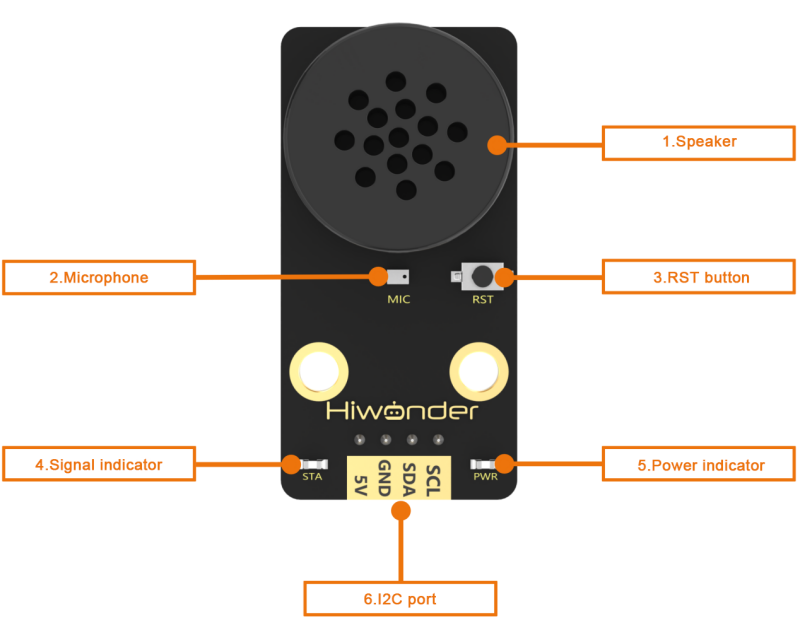
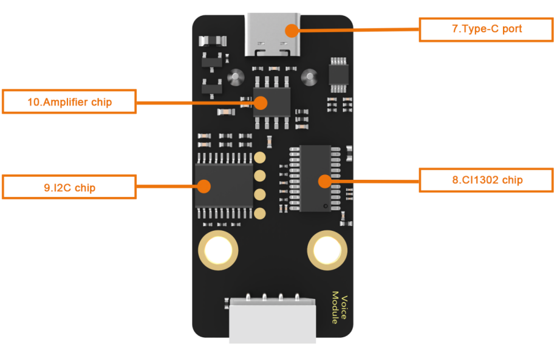

# 1. Module Introduction

## 1.1 Introduction

The WonderEcho is an all-in-one voice interaction module built on the CI1302 chip, designed for speech recognition and playback. It supports offline neural network (NN) acceleration and hardware-accelerated voice signal processing, leveraging advanced noise reduction and neural network models to deliver highly accurate recognition results.

The CI1302 chip features a Brain Neural Processing Unit (BNPU), supporting offline NN acceleration and hardware-accelerated speech processing. With a CPU clock speed of up to 220 MHz, it enables far-field voice recognition in offline mode. Additionally, it has 2MB of built-in flash storage, capable of recognizing up to 300 command words.

Thanks to its user-friendly operation and outstanding speech recognition performance, the WonderEcho module is ideal for a wide range of applications, including smart home systems, conversational robots, educational robots, and in-vehicle dispatch terminals.

## 1.2 Working Principle

This module operates in wake word activation mode, requiring users to say a designated wake word to activate the voice interaction module before issuing commands. The default wake word is **"Hello Hiwonder"**. If no voice input is detected within 15 seconds, the module will enter sleep mode and must be reactivated before further use.

Once the CI1302 chip recognizes a voice command, it transmits the corresponding instruction to the IIC chip, which then processes and broadcasts the response. The IIC chip stores the received command and transmits it using the IIC slave protocol.

This module supports customization of both wake words and command words. For instructions on modifying them, please refer to [3. Modifying Wake Words and Command Words](3_Modify_Wake_up_and_Command_Words.md).

## 1.3 Notice

(1) Ensure the module is powered with 5V to prevent damage.

(2) Keep the surroundings quiet, as background noise may affect recognition accuracy.

(3) Speak loudly and clearly at a moderate pace. Maintain a distance of approximately 5 meters from the module for optimal performance.

## 1.4 Port Instruction

| **No.** | **Hardware name** | **Instruction** |
| :--: | :--: | :--: |
| 1 | Speaker | Convert the analog signal into sound |
| 2 | Microphone | Convert the sound into analog signal |
| 3 | RST button | Reset button |
| 4 | Blue signal indicator | Signal indicator remains on continuously, and it will blink once while a keyword is detected |
| 5 | Red power indicator | It remains on when the power supply is normal |
| 6 | I2C port | Serve as an I2C slave device, providing power and facilitating communication with the master device |
| 7 | Type-C port | For power supply and firmware update for the CI1302 chip. |
| 8 | CI1302 chip | A high-performance voice recognition chip. It recognizes voice and outputs corresponding signals |
| 9 | I2C chip | Transform the commands from the voice recognition chip into commands of the I2C protocol |
| 10 | Amplifier chip | Convert digital signals into analog signals to drive the speaker |

## 1.5 Test Instruction

(1) Connect the WonderEcho module to your PC using a Type-C data cable.

(2) Activate the module by saying the wake-up word **"Hello Hiwonder"**.

(3) Test the module by speaking one of the command words: **"go straight"**, **"go backward"**, **"turn left"**, or **"turn right"**.

(4) If no voice input is detected within 15 seconds, the module will enter sleep mode and must be reactivated before further use.