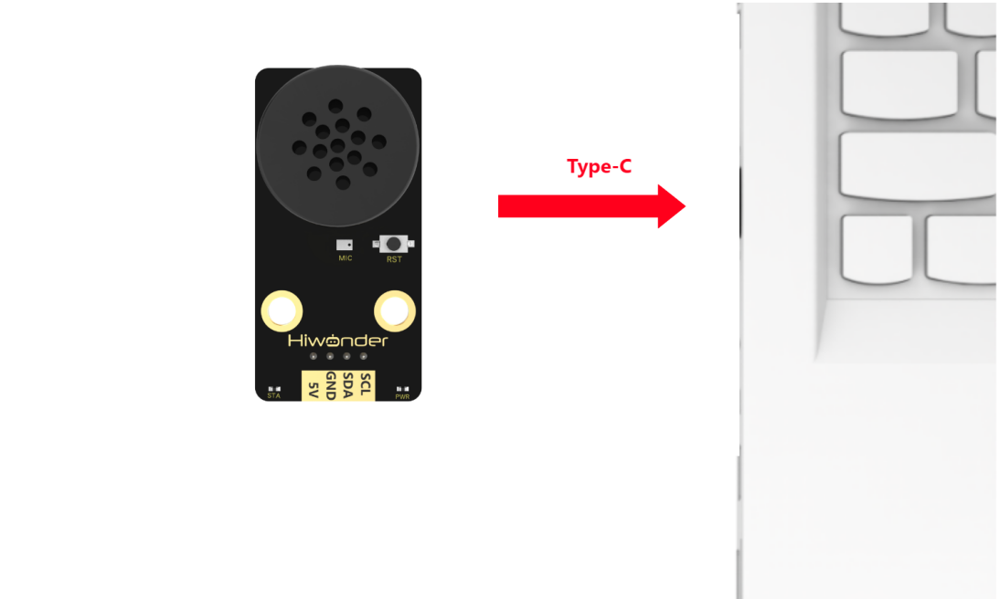

# 2.Getting Started

:::{Note}

* The voice recognition firmware is pre-installed before delivery, allowing for a quick and easy experience with its functionality.

* When powering on the voice module, ensure it does not come into contact with metal components to prevent potential short circuits.

:::

## 2.1 Device Connection

Connect the WonderEcho module to the computer using a Type-C cable.

# 2.2 Voice Recognition and Speech Broadcast

To wake up the voice interaction module, say "**Hello Hiwonder**." When the module responds with "**I'm here,**" it indicates that it is in recognition mode. If no command is detected within 15 seconds, the module will announce "I'm going to take a break" and enter sleep mode. In this case, you will need to wake it up again to continue using it.

The default firmware includes preloaded command words and broadcast statements. Broadcast statements are passive and must be triggered by sending data to the module. For more details, please refer to [Command Word Broadcasting Protocol List](Appendix.md).

(1) In active broadcast mode, when you say a command word to the voice interaction module, it will actively announce the corresponding statement. Let's take the command word "**go straight**" as an example. First, say "**Hello Hiwonder**" to wake up the module, and then say the command word "**go straight**". Once the module recognizes it, it will broadcast "**going straight**".

(2) In passive broadcast mode, you need to write the corresponding broadcast data to the register for passive broadcast statement. This allows the module to broadcast the corresponding statement. For detailed instructions, please refer to [4. Multiple Controller Communication](4_Multiple_Controller_Communication_Tutorial.md).