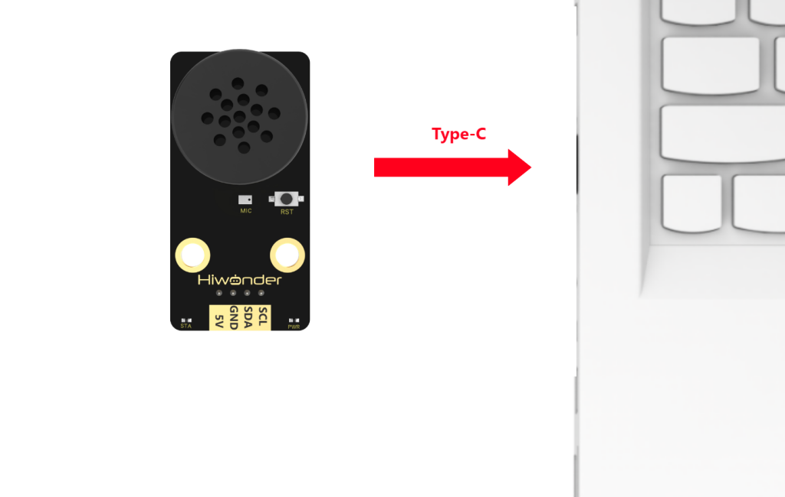
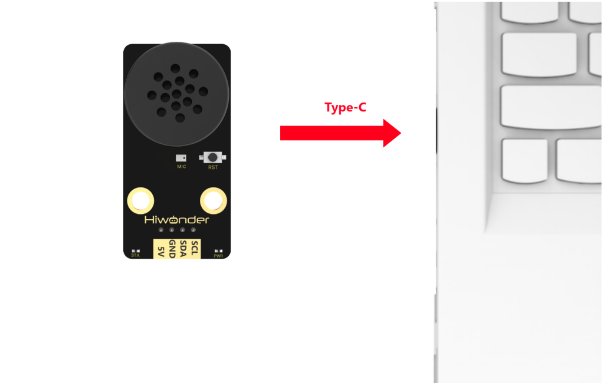
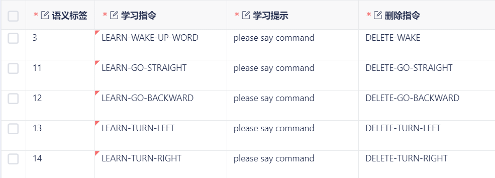

# 3. Modify Wake-up and Command Words

## 3.1 Modify Wake-up Word

:::{Note}
* Please modify the wake-up phrase in a quiet enviroment, as ambient noise may affect and reduce the recogition accuracy of WonderEcho voice interaction module.
* When speaking, please use a loud and clear voice at a moderate speed, and keep a distance of mo more than 5 meters from the module.

:::

### 3.1.1 Device Connection

Connect the module to the computer with a Type-C cable.

### 3.1.2 Modify Wake-up Word

(1) Wake up the module by saying **"HELLO-HI-WONDER"**. When the module responds with **"I'm here"**, it indicates that the module is in recognition mode.

(2) Say the command "**LEARN-WAKE-UP-WORD**" to the voice interaction module. If the module responds with "**please say command**," it means the module has entered wake-up word learning mode.

(3) Say the desired wake-up word to the module. It is recommended to choose a short word. For example, set **"Hiwonder"** as the wake-up word.

(4) Once the module successfully recognizes the word, it will announce **"learning succeed"**, confirming that the wake-up word has been successfully modified. You can now use **"Hiwonder"** to activate the module.

:::{Note}
The default wake-up word, **"HELLO-HI-WONDER"**, in the factory firmware is the primary wake-up word and cannot be modified or deleted via voice. The custom wake-up word set by the user can only exist alongside the default wake-up word, meaning only one custom wake-up word can be active in addition to the default.
:::

## 3.2 Modify Command Word

:::{Note}
* Please modify the wake-up phrase in a quiet enviroment, as ambient noise may affect and reduce the recogition accuracy of WonderEcho voice interaction module.
* When speaking, please use a loud and clear voice at a moderate speed, and keep a distance of mo more than 5 meters from the module.

:::

### 3.2.1 Device Connection

Connect the module to the computer with a Type-C cable.

### 3.2.2 Modify Command Word

The default firmware within the voice recognition module has 4 preset command words that can be modify by voice, as shown below:

For example:

(1) Wake up the module by saying **"HELLO-HI-WONDER"**. When the module responds with **"I'm here"**, it indicates that the module is ready for recognition.

(2) Say the command  "**LEARN-GO-STRAIGHT**" to the module. If it responds with **"Please say command"**, it means the module has entered command word learning mode.

(3) Say the desired command word to the module. It is recommended to choose a short and clear command. For example, set **"go forward"** as the new command word.

(4) Once the module successfully recognizes the command, it will broadcast **"learning succeed"**, confirming the modification. From now on, you can use **"go forward"** to perform the same action as the default **"go straight"** command.

(5) To delete the **"go forward"** command, simply say "**DELETE-GO-STRAIGHT**". When the module responds with **"Deleting succeeded"**, the command will be removed. Note that this only deletes the **"go forward"** command.

:::{Note}
The default command words in the firmware cannot be modified or deleted via voice. Any custom command word added can only exist alongside the default ones, meaning only one custom command word can be active at a time in addition to the default commands.
:::