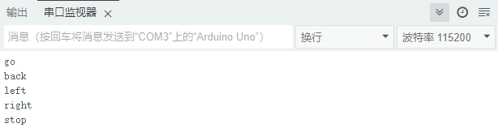
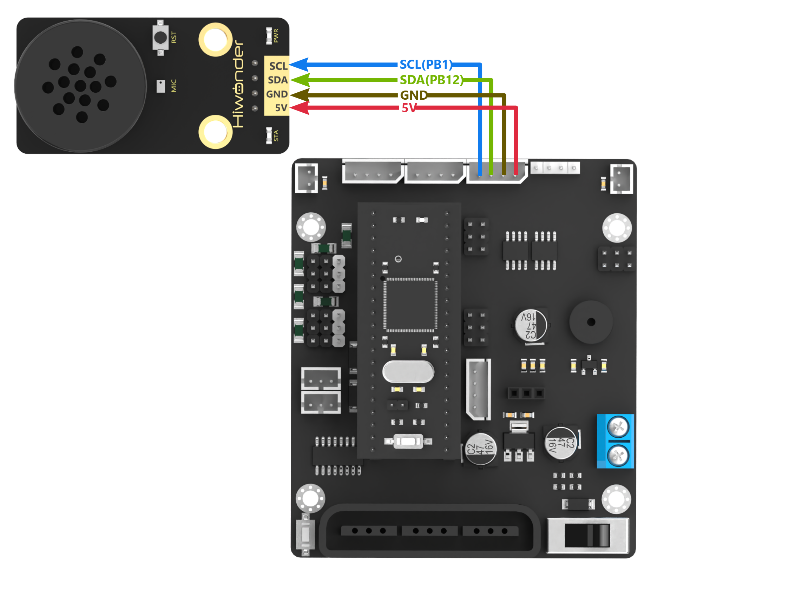
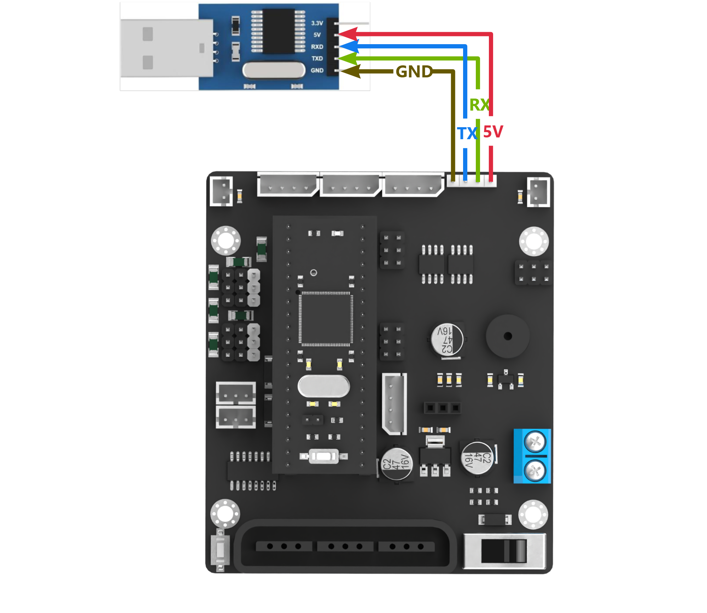
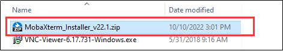
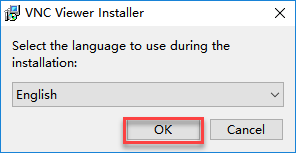
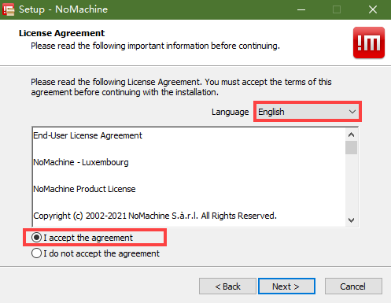
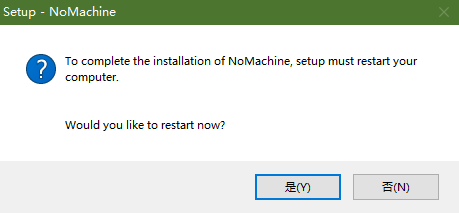
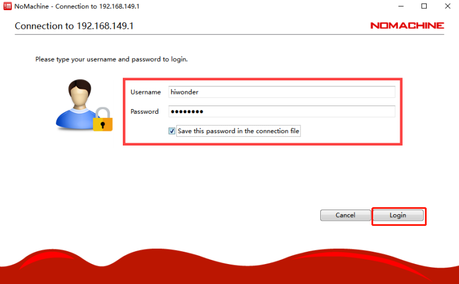

# 4. Multiple Controller Communication Tutorial

## 4.1 Master-Slave Device Communication Principles

### 4.1.1 Introduction

This section provides detailed information about the master-slave relationship between the voice recognition module and various devices (such as Arduino, STM32) during communication. It explains how the voice recognition module functions as a subordinate device, communicating with other devices, which act as master devices to control the module.

In this chapter, the voice recognition module is primarily used as a subordinate device, utilizing the I2C communication protocol to transmit data to other devices.

### 4.1.2 Master-Slave Relationship

* **Voice Recognition Module Function**

(1) Receiving and Parsing Signals from the Master Device

The module waits for an I2C signal interrupt. When data is received through I2C, the module calls the corresponding function based on the register address information provided by the I2C signal.

(2) Data processing and feedback: When the module receives a command to read a register, it triggers the corresponding function to send the recognized data back to the master device.

* **Master Device Functions**

(1) Sending Commands

The master device is responsible for sending read data commands to the voice recognition module.

(2) Control Coordination

The master device manages the entire system, ensuring there are no communication or operational conflicts between the voice recognition module and other devices, thus maintaining system stability.

(3) Data Reception

When reading data, the master device sends the read command and waits to receive the status information data from the voice recognition module. It then parses the received data packet to extract the relevant information.

### 4.1.3 I2C Device Address and Register

The address of the I2C slave device for the WonderEcho voice interaction module is `0x34`.

| **Register** | **Function** |
|:--:|:--:|
| 0x64 (Register Address) | This register stores the recognized voice results, with a 1-byte value.<br/>(If no recognition occurs, the result will be `0x00`.) |
| 0x6E (Register Address) | This register is used to set the ID for broadcasting, with a 2-byte value.<p>The first byte can be either **0x00** or **0xFF**:</p><p>**0x00** represents the **command word broadcasting** type.</p><p>**0xFF** represents the **normal broadcasting** type.</p><p>The second byte represents the **ID number**.</p> |

Due to the large number of entries, the corresponding types and ID numbers can be found in the protocol documentation.

::: {Note}
The master device and the module can have separate power sources, but they must share a common ground to ensure stable communication and voltage levels.
:::

## 4.2 ID Analysis for Command Word & Broadcast Statement

Open the **[Command Word Broadcasting Protocol List](Appendix.md)** file located in the same directory as this lesson. This file contains the communication protocol for CI1302 and I2C chips.

The protocol begins with `0xAA`, `0x55` and ends with `0xFB`. The two bytes in between represent the function type and the ID number, respectively.

### 4.2.1 Functional Command Word

The first section of the protocol document consists of functional command word for voice recognition. These command words are used to configure the voice interaction module and typically do not require any modifications.


### 4.2.2 Command Entries

Below are examples of recognized command words. The two middle bytes in each command are `0x00` and the ID number, respectively. For example:


Example:

When the voice interaction module recognizes the **"Move Forward"** command, it responds with **"Moving forward."** The main controller can then read `0x01` (a single byte) from the recognition result register (`0x64`). This byte corresponds to the 4th byte in the **"Move Forward"** command protocol.

### 4.2.3 Broadcast Statement

The broadcast phrases will not be played automatically. They must be triggered by the main controller through I2C settings. (The broadcast phrases for command entries can also be played.)
To trigger a broadcast, the main controller writes two bytes to the broadcast register (`0x6E`) via I2C: one byte for the type and one byte for the ID number. The voice interaction module will then broadcast the corresponding phrase. There are two types of broadcasts:

* **0x00** for command entry phrases (as defined in section 2: Command Entries).

* **0xFF** for general broadcast phrases.


Example:
To broadcast **"Kitchen Waste,"** the main controller needs to write `0xFF` `0x02` to the broadcast register (`0x6E`) via I2C. The voice interaction module will then broadcast **"Kitchen Waste."**

## 4.3 Arduino Communication

### 4.3.1 Arduino Voice Recognition

* **Getting Ready**

(1) Wiring Instruction

Connect the 5V, GND, SDA, and SCL pins of the voice recognition module to the corresponding pins on the Arduino.


::: {Note}
Before powering on, ensure that no metal objects come into contact with the controller. This action prevents a short circuit caused by the bottom pins of the controller, which may damage the controller.
:::

(2) Arduino Program Download

[Source Code](../_static/source_code/Arduino_Communication.zip)

① Connect Arduino controller to the computer with a data cable.

② Locate and open **"ASRcontrol\ASRcontrol.ino"** program file .


(3) Click **"Select Board,"** and the software will automatically detect the current Arduino serial port. Next, click to connect.


(4) Click  to download the program into Arduino. Then just wait for it to complete.


* **Test Case**

This program allows the voice recognition module to recognize predefined commands.

(1) Program Outcome

① When the command **"go straight"** is recognized, the voice recognition module will broadcast **"going straight,"** and the serial port will print **"go."**

② When the command **"go backward"** is recognized, the voice recognition module will broadcast **"going backward,"** and the serial port will print **"back."**

③ When the command **"turn left"** is recognized, the voice recognition module will broadcast **"turning left,"** and the serial port will print **"left."**

④ When the command **"turn right"** is recognized, the voice recognition module will broadcast **"turning right,"** and the serial port will print **"right."**

⑤ When the command **"stop"** is recognized, the voice recognition module will broadcast **"copy that,"** and the serial port will print **"stop."**



(2) Brief Program Analysis

① Import the necessary libraries for `Wire` and `ASR_module` to enable communication with the voice recognition module.

{lineno-start=10}

```python
#include <Wire.h>
#include "ASR_module.h"
```

② Create an object for the voice recognition module. Initialize the variable **"result"** to receive data from the module. Set the serial baud rate to `115200`.

{lineno-start=18}

```python
ASR_MOUDLE asr;

uint8_t result = 0;

void setup()
{
  Serial.begin(115200);
  Serial.println("Start");
}
```

③ In the main function, call the `asr.rec_recognition()` function to retrieve data from the voice recognition module.

{lineno-start=28}

```python
void loop()
{
  result = asr.rec_recognition();  //Return Recognition Result: The recognized entry ID.
```

④ When the command **"go straight"** is recognized, the module will return `0x01`. When **"go backward"** is recognized, it will return `0x02`, and so on for other command words. Each command corresponds to a specific hexadecimal value. For a detailed list of the data, please refer to the [Command Word & Broadcast Statement Protocol List](../_static/source_code/Command_Word_Broadcast_Statement_Protocol_List.zip).

{lineno-start=31}

```python
  if(result != 0)
  {
    if(result == 0x01)
    {
      Serial.println("go");
    }else if(result == 0x02)
    {
      Serial.println("back");
    }else if(result == 0x03)
    {
      Serial.println("left");
    }else if(result == 0x04)
    {
      Serial.println("right");
    }else if(result == 0x09)
    {
      Serial.println("stop");
    }
  }
  delay(50);
}
```

### 4.3.2 Arduino Voice Broadcast

* **Getting Ready**

(1) Wiring Instruction

Connect the 5V, GND, SDA, and SCL pins of the voice recognition module to the corresponding pins on the Arduino.


::: {Note}
Before powering on, ensure that no metal objects come into contact with the controller. This action prevents a short circuit caused by the bottom pins of the controller, which may damage the controller.
:::

(2) Arduino Program Download

[Source Code](../_static/source_code/Arduino_Communication.zip)

① Connect Arduino controller to the computer with a data cable.

② Locate and open **"ASRcontrol\ASRcontrol.ino"** program file in the same directory of this section.


③ Click **"Select Board,"** and the software will automatically detect the current Arduino serial port. Next, click to connect.


④ Click  to download the program into Arduino. Then just wait for it to complete.


* **Test Case**

This program enables the voice recognition module to broadcast the prewritten statements.

(1) Program Outcome

The voice recognition module is controlled to sequentially broadcast **"Going straight,"** **"Turning left,"** **"Recyclable waste,"** and **"Hazardous waste"** in a loop, with a 5-second interval for each broadcast.

(2) Brief Program Analysis

① Import the necessary libraries for `Wire` and `ASR_module` to enable communication with the voice recognition module.

{lineno-start=10}

```python
#include <Wire.h>
#include "ASR_module.h"
```

② Create an object for the voice recognition module. Initialize the **"result"** variable to receive data from the module. Set the serial baud rate to `115200`.

{lineno-start=18}

```python
ASR_MOUDLE asr;

uint8_t result = 0;

void setup()
{
  Serial.begin(115200);
  Serial.println("Start");
}
```

③ In the main function, call the `asr.speak()` function to send data to the voice recognition module. This function takes two parameters:

{lineno-start=61}

```python
    void ASR_MOUDLE::speak(uint8_t cmd , uint8_t id)
    {
      if(cmd == 0xFF || cmd == 0x00)
      {
        send[0] = cmd;
        send[1] = id;
        WireWriteDataArray(ASR_SPEAK_ADDR , send , 2);
      }
    }
```

④ The `ASR_COMMAND` register address in the voice recognition module signifies a command word. When its value is `0x00`, it indicates the function type being written is a command word. For example, writing `0x01` to the `ASR_COMMAND` register corresponds to the broadcast statement **"Going straight"** from the data list, while `0x03` corresponds to **"Turning left."**

{lineno-start=28}

```python
void loop()
{
  asr.speak(ASR_CMDMAND , 0x01); // Command word broadcast: "Going forward"
  delay(5000);
  asr.speak(ASR_CMDMAND , 0x03); // Command word broadcast: "Turning left"
  delay(5000);
```

⑤ If the value of `ASR_ANNOUNCER` is set to `0xFF`, it indicates the function type being written is a broadcast statement. For instance, writing `0x01` to the `ANNOUNCER` register corresponds to the broadcast statement **"Recyclable waste"** from the data list, while `0x03` corresponds to **"Hazardous waste."**

{lineno-start=35}

```python
  asr.speak(ASR_ANNOUNCER , 0x01); // Broadcast: "Recyclable Waste"
  delay(5000);
  asr.speak(ASR_ANNOUNCER , 0x03); // Broadcast: "Hazardous Waste"
  delay(5000);
}
```

## 4.4 STM32 Communication

### 4.4.1 STM32F103 Voice Recognition

* **Getting Ready**

(1) Wiring Instruction

Connect the voice recognition module to the corresponding port on the STM32 board with a 4Pin wire.



::: {Note}
Before powering on, ensure that no metal objects come into contact with the controller. This action prevents a short circuit caused by the bottom pins of the controller, which may damage the controller.
:::

(2) Program Download

[Source Code](https://drive.google.com/drive/folders/1OCajOWsLT3dxVNVk-MTpxB6k0C6gTbt8?usp=sharing)

Prepare an STM32F103 controller, an open-source robot controller, DuPont wires, and a USB to TTL converter.

① Connect the STM32 board to the PC via the USB to TTL tool.


② Open the STM32 program file in the **"STM32F103_Asr_recognition"**.


③ Generate all the code to the executable file.


④ Remove the jumper cap on the development board. Press the `RST` button.


⑤ Open the mcuisp software . Select the corresponding serial port, and set the baud rate to `115200`. Download the program to the development board.


⑥ Click  to open the hex file **"STM32F103_Asr_recognition\Obj\OpenArmSTM32"**.


⑦ Click **"Start ISP"** to flash the generated hex file into the STM32 control board.


⑧ After the download is completed, reconnect the jumper cap to the STM32. Press the `RST` button to run the program.

* **Test Case**

This program enables the voice recognition module to recognize the prewritten commands.

(1) When the command **"go straight"** is recognized, the voice recognition module will broadcast **"going straight,"** and the serial port will print **"go."**

(2) When the command **"go backward"** is recognized, the voice recognition module will broadcast **"going backward,"** and the serial port will print **"back."**

(3) When the command **"turn left"** is recognized, the voice recognition module will broadcast **"turning left,"** and the serial port will print **"left."**

(4) When the command **"turn right"** is recognized, the voice recognition module will broadcast **"turning right,"** and the serial port will print **"right."**

(5) When the command **"stop"** is recognized, the voice recognition module will broadcast **"copy that,"** and the serial port will print **"stop."**

* **Brief Program Analysis**

(1) Import the necessary libraries for I2C communication with the voice recognition module.

{lineno-start=1}

```c
#include "include.h"
#include "IIC.h"
#include <string.h>
```

(2) Initialize the serial port and I2C communication. Set the baud rate to `9600`.

{lineno-start=16}

```c
	SystemInit();
	InitDelay(72); //Initialize delay functions
	Usart1_Init(); //Initialize UART1
	IIC_Init();		//Initialize I2C
    DelayMs(200);
	printf("start");
```

(3) In the main function, create a `result` variable to store the recognition result. Use the `Asr_Result()` function to obtain the recognition result.

{lineno-start=24}

```c
		u8 result;
		result = Asr_Result(); //Return the recognition result, i.e., the ID of the recognized phrase
```

(4) When the command **"go straight"** is recognized, the module will return `0x01`. When **"go backward"** is recognized, it will return `0x02`, and so on for other command words. Each command corresponds to a specific hexadecimal value. For a detailed list of the data, please refer to the **"4.5 Command Word Broadcasting Protocol List"**.

{lineno-start=26}

```py
		if(result != 0)
        {
            if(result == 0x01)
            {
                printf("go");
            }else if(result == 0x02)
            {
                printf("back");
            }else if(result == 0x03)
            {
                printf("left");
            }else if(result == 0x04)
            {
                printf("right");
            }else if(result == 0x09)
            {
                printf("stop");
            }
        }
		DelayMs(50);
	}
}
```

### 4.4.2 STM32F407 Voice Recognition

* **Getting Ready**

(1) Wiring Instruction

Connect the voice recognition module to the corresponding port on the STM32F407 board with a 4Pin wire.


::: {Note}
Before powering on, ensure that no metal objects come into contact with the controller. This action prevents a short circuit caused by the bottom pins of the controller, which may damage the controller.
:::

(2) Program Download

[Source Code](https://drive.google.com/file/d/1r3G6OZyehRaJ02ISqkuUrrFc0ucCiXe9/view?usp=sharing)

① Connect the `UART1` port on the STM32 controller to the PC using a Type-C cable.


② Open the **Device Manager** to check the serial port number.


③ Launch the ATX-XISP software, select the corresponding serial port, and set the baud rate to `115200`.


④ Follow the instructions below to configure the settings.


⑤ Click **"File"** and select the program file: `STM32F407_ASR_recognition\MDK-ARM\RosRobotControllerM4\RosRobotControllerM4.hex` for downloading.


⑥ Click **"Start Programming"** to flash the generated hex file onto the STM32 control board.


* **Test Case**

This program uses the STM32F407 development board to obtain the module's recognition result, printing the result via the `UART1`.

(1) When the command **"go straight"** is recognized, the voice recognition module will broadcast **"going straight,"** and the serial port will print **"go."**

(2) When the command **"go backward"** is recognized, the voice recognition module will broadcast **"going backward,"** and the serial port will print **"back."**

(3) When the command **"turn left"** is recognized, the voice recognition module will broadcast **"turning left,"** and the serial port will print **"left."**

(4) When the command **"turn right"** is recognized, the voice recognition module will broadcast **"turning right,"** and the serial port will print **"right."**

(5) When the command **"stop"** is recognized, the voice recognition module will broadcast **"copy that,"** and the serial port will print **"stop."**

* **Brief Program Analysis**

(1) Import the necessary libraries for I2C communication with the voice recognition module.

{lineno-start=12}

```c
#include "cmsis_os2.h"
#include "global.h"
```

(2) Define the I2C address of the voice recognition module, as well as the register, command word, and broadcast statement.

{lineno-start=15}

```c
#define ASR_ADDR  0x34

//Storage location for recognition results; continuously reading this address determines whether a voice command has been recognized, with different values corresponding to different commands.
//识别结果存放处，通过不断读取此地址的值判断是否识别到语音，不同的值对应不同的语音
#define ASR_RESULT_ADDR   100
#define ASR_SPEAK_ADDR    110

#define ASR_CMDMAND    0x00
#define ASR_ANNOUNCER  0xFF
```

(3) In the main function, create a `result` variable to store the recognition result. Use the `HAL_I2C_Mem_Read()` function to obtain the recognition result.

{lineno-start=35}

```c
        uint8_t result = 0;
        HAL_I2C_Mem_Read(&hi2c2, ASR_ADDR << 1, ASR_RESULT_ADDR, I2C_MEMADD_SIZE_8BIT, &result, 1, 0xFF);
```

(4) When the command word **"go straight"** is recognized, the module will return `0x01`. If **"go backward"** is recognized, it will return `0x02`. This pattern continues for other command words, with each corresponding to a specific hexadecimal value. For a detailed list of these values, please refer to the [Command Word Broadcasting Protocol List](../_static/source_code/Command_Word_Broadcast_Statement_Protocol_List.zip).

{lineno-start=37}

```python
        if(result != 0)
        {
            if(result == 0x01)
            {
              printf("go");
            }else if(result == 0x02)
            {
              printf("back");
            }else if(result == 0x03)
            {
              printf("left");
            }else if(result == 0x04)
            {
              printf("right");
            }else if(result == 0x09)
            {
              printf("stop");
            }
        }
        osDelay(100); //Delay(延时)
	}
}
```

### 4.4.3 STM32F103 Voice Broadcast

* **Getting Ready**

(1) Wiring Instruction

Connect the voice recognition module to the corresponding port on the STM32 board with a 4Pin wire.


::: {Note}
Before powering on, ensure that no metal objects come into contact with the controller. This action prevents a short circuit caused by the bottom pins of the controller, which may damage the controller.
:::

(2) Program Download

[Source Code](https://drive.google.com/drive/folders/1aFn3V6CAVDdIoA0LYsWhxdwEABsr4rLS?usp=sharing)

Prepare an STM32F103 development board, an open-source robot controller, DuPont wires, and a USB to TTL converter.

① Connect the STM32 board to the PC via the USB to TTL tool.



② Open the STM32 program file in the **"STM32F103_Asr_announce"**.


③ Generate all the code to the executable file.


④ Remove the jumper cap on the development board. Press the `RST` button.


⑤ Open the mcuisp software . Select the corresponding serial port, and set the baud rate to `115200`. Download the program to the development board.


⑥ Click  to open the hex file **"STM32F103_Asr_announce\Obj\OpenArmSTM32"**.


⑦ Click **"Start ISP"** to flash the generated hex file into the STM32 control board.


⑧ After the download is completed, reconnect the jumper cap to the STM32. Press the `RST` button to run the program.

* **Test Case**

This program enables the voice recognition module to broadcast the prewritten statements.

The voice recognition module is controlled to sequentially broadcast **"Going straight,"** **"Turning left,"** **"Recyclable waste,"** and **"Hazardous waste"** in a loop, with a 5-second interval for each broadcast.

* **Brief Program Analysis**

(1) Import the necessary libraries for I2C communication with the voice recognition module.

{lineno-start=1}

```c
#include "include.h"
#include "IIC.h"
#include <string.h>
```

(2) Initialize the serial port and I2C communication, and set the baud rate to `9600`.

{lineno-start=16}

```c
	SystemInit();
	InitDelay(72);	//Initialize the delay function
	Usart1_Init(); //Initialize the serial port
	IIC_Init();		//IIC initialization
  DelayMs(200);
	printf("start");
```

(3) In the main function, use the `asr.speak()` function to write data to the voice recognition module. This function requires two parameters:

* **Parameter 1:** The register address, indicating whether the data is a command word or a broadcast statement.

* **Parameter 2:** The corresponding value of the broadcast statement.

{lineno-start=155}

```c
void Asr_Speak(u8 cmd ,u8 idNum)
{	
    int i;
	int addr = Asr_Addr;
    u8 send[2] = {0x00 , 0x00};
    if(cmd == 0xFF || cmd == 0x00)
    {
        send[0] = cmd;
        send[1] = idNum;
        IIC_Start();
        IIC_Send_Byte(addr<<1 | 0); 
        IIC_Wait_Ack();
        IIC_Send_Byte(ASR_SPEAK_ADDR);
        IIC_Wait_Ack();
        //IIC_Stop();
        for(i = 0; i < 2; ++i)
        {
            IIC_Send_Byte(send[i]);
            IIC_Wait_Ack();
        }
        IIC_Stop(); 
        DelayMs(20);
    }
}
```

(4) The `ASR_COMMAND` register address represents the command word section of the voice recognition module. When its value is `0x00`, it indicates that the function type is a command word.

*   For example, writing `0x01` to the `ASR_COMMAND` register corresponds to the broadcast statement **"Going straight"** from the data list.

*   Similarly, writing `0x03` corresponds to the broadcast statement **"Turning left"**.

{lineno-start=24}

```c
        Asr_Speak(ASR_CMDMAND , 0x01); // Command phrase playback: "Moving forward"
        DelayMs(5000);
        Asr_Speak(ASR_CMDMAND , 0x03); // Command phrase playback: "Turning left"
        DelayMs(5000);
```

(5) If the value of `ASR_ANNOUNCER` is set to `0xFF`, it specifies that the function type is a broadcast statement.

*   Writing `0x01` to the `ASR_ANNOUNCER` register corresponds to the broadcast statement **"Recyclable waste"**.

*   Similarly, writing `0x03` corresponds to the broadcast statement **"Hazardous waste"**.

{lineno-start=28}

```python
        Asr_Speak(ASR_ANNOUNCER , 0x01); // Announcement phrase playback: "Recyclable waste"
        DelayMs(5000);
        Asr_Speak(ASR_ANNOUNCER , 0x03); // Announcement phrase playback: "Hazardous waste"
        DelayMs(5000);
	}
}
```

(6) For a detailed list of the data values, please refer to the **"4.5 Command Word Broadcasting Protocol List"**.

### 4.4.4 STM32F407 Voice Broadcast

* **Getting Ready**

(1) Wiring Instruction

Connect the voice recognition module to the corresponding port on the STM32F407 board with a 4Pin wire.


::: {Note}
Before powering on, ensure that no metal objects come into contact with the controller. This action prevents a short circuit caused by the bottom pins of the controller, which may damage the controller.
:::

(2) Program Download

[Source Code](https://drive.google.com/file/d/1uOrxQZC8Hv-tFZmhQNHNLbalJtAU_RpU/view?usp=sharing)

① Connect the `UART1` port on the STM32 controller to the PC with a Type-C cable.


② Open the device manager to check the serial port number.


③ Open the ATX-XISP software to select the corresponding serial port. Set the baud rate to `115200`.


④ Follow the instructions below to configure it.


⑤ Decompress the [STM32F407_ASR_announce.zip](https://drive.google.com/file/d/1uOrxQZC8Hv-tFZmhQNHNLbalJtAU_RpU/view?usp=sharing) file in the same directory as this lesson. Click **"File"** in the software to select the program file `STM32F407_ASR_announcement\MDK-ARM\RosRobotControllerM4\RosRobotControllerM4.hex` for downloading.


(6) Click **"Start programming"** to flash the generated hex file into the STM32 control board.


* **Test Case**

This program enables the voice recognition module to broadcast the prewritten statements.

The voice recognition module is controlled to sequentially broadcast **"Going straight,"** **"Turning left,"** **"Recyclable waste,"** and **"Hazardous waste"** in a loop, with a 5-second interval for each broadcast.

* **Brief Program Analysis**

(1) Import function libraries related to controller communication for the voice recognition module.

{lineno-start=12}

```c
#include "cmsis_os2.h"
#include "global.h"
```

(2) Define the I2C address of the voice recognition module. Define the register, command word, and broadcast statement.

{lineno-start=17}

```c
// Recognition result storage; continuously reading this address determines if a voice command is recognized, with different values representing different commands.
// 识别结果存放处，通过不断读取此地址的值判断是否识别到语音，不同的值对应不同的语音
#define ASR_RESULT_ADDR   100
#define ASR_SPEAK_ADDR    110

#define ASR_CMDMAND    0x00
#define ASR_ANNOUNCER  0xFF
```

(3) In the main function, call the `HAL_I2C_Mem_Write()` function to write data to the voice recognition module. The function contains two parameters. Within the `speak_cmd` array, the parameter 1 is the register address of the command word. Parameter 2 represents the value of the corresponding broadcast statement. The `ASR_COMMAND` signifies the register address of the command word within the voice recognition module. When its value is `0x00`, it means that the function type to be written is a command word. Start by writing `0x01` to the register address `ASR_COMMAND`, which corresponds to the broadcast statement **"Going straight"** in the data list. Similarly, the value `0x03` corresponds to the **"Turning left"**.

{lineno-start=33}

```c
	// Loop: In RTOS tasks, the loop must include osDelay or another system blocking function, otherwise it may cause system instability.
	// 循环  : RTOS任务中的循环，必须要有osDelay或者其他系统阻塞函数，否则会导致系统异常
    for(;;) {
        uint8_t speak_cmd[2] = {ASR_CMDMAND , 0x01};
        HAL_I2C_Mem_Write(&hi2c2, ASR_ADDR << 1, ASR_SPEAK_ADDR, I2C_MEMADD_SIZE_8BIT, speak_cmd, 2, 0xFF); // Command phrase playback: "Moving forward"(命令词播报语 播报：正在前进)
        osDelay(5000);
        
        speak_cmd[1] = 0x03;
        HAL_I2C_Mem_Write(&hi2c2, ASR_ADDR << 1, ASR_SPEAK_ADDR, I2C_MEMADD_SIZE_8BIT, speak_cmd, 2, 0xFF); // Command phrase playback: "Turning left"(命令词播报语 播报：正在左转)
        osDelay(5000);
```

(4) Within the `speak_ann` array, the parameter 1 is the register address of the broadcast statement. Parameter 2 represents the value of the corresponding broadcast statement. If the value of `ASR_ANNOUNCER` is set to `0xFF`, it indicates that the function type to be written is broadcast statement. Write `0x01` to the register address `ANNOUNCER`, which corresponds to the broadcast statement **"Recyclable waste"** in the data list. Similarly, the data `0x03` corresponds to **"Hazardous waste"**.

{lineno-start=44}

```python
        uint8_t speak_ann[2] = {ASR_ANNOUNCER , 0x01};
        HAL_I2C_Mem_Write(&hi2c2, ASR_ADDR << 1, ASR_SPEAK_ADDR, I2C_MEMADD_SIZE_8BIT, speak_ann, 2, 0xFF); // Announcement playback: "Recyclable waste"(播报语 播报：可回收物)
        osDelay(5000);
        
        speak_ann[1] = 0x03;
        HAL_I2C_Mem_Write(&hi2c2, ASR_ADDR << 1, ASR_SPEAK_ADDR, I2C_MEMADD_SIZE_8BIT, speak_ann, 2, 0xFF); // Announcement playback: "Hazardous waste"(播报语 播报：有害垃圾)
        osDelay(5000);
	}
}
```

(5) For the detailed data list, please refer to the [Command Word&Broadcast Statement Protocol List](../_static/source_code/Command_Word_Broadcast_Statement_Protocol_List.zip).

<p id="anchor_4_5"></p>

## 4.5 Raspberry Pi Communication

### 4.5.1 Remote Connectivity and File Transfer

* **Preparation**

(1) Hardware Preparation

Prepare a laptop for the setup. If you're using a desktop computer, make sure to have a wireless network adapter, as it is necessary to connect both the desktop and the Raspberry Pi 5 to the same local network.

(2) MobaXterm Tool Installation and Usage

MobaXterm is a software that integrates various remote computing tools and provides a graphical interface. By connecting to the Raspberry Pi's Wi-Fi hotspot, you can control the Raspberry Pi directly from your computer. Follow the steps below to install the software:

① Extract the [MobaXterm_Installer_v22.1.zip](Appendix.md) file.



② Double-click the **"MobaXterm_installer_22.1.msi"** file in the extracted **"MobaXterm_Installer_v22.1"** folder and click **"Next."**


③ In the pop-up window, accept the license agreement and click **"Next."**


④ Choose the installation path and click **"Next."**


⑤ Click **"Install."**


⑥ Wait for the installation to complete. Once finished, a prompt will appear indicating the installation is complete. Click the **"Finish"** button to complete the process.


(3) Start Raspberry Pi 5

① Connect the Raspberry Pi 5 to the local network. In this tutorial, the Raspberry Pi 5 is already connected to the **"Hiwonder"** hotspot. Next, connect your computer to the same **"Hiwonder"** hotspot.


② Press **Win** + **R** to open the **"Run"** dialog, type **"cmd"** and press Enter to open the Command Prompt in administrator mode.


③ Type the command **"ping raspberrypi -4"** and press Enter to find the IP address assigned to the Raspberry Pi 5 by the hotspot.


* **Connect to Raspberry Pi 5 using MobaXterm**


(1) Open MobaXterm. In the main interface, click on the **"Session"** button in the top-left corner to create a new session.


(2) In the session window, select **"SSH."** Enter the Raspberry Pi's IP address (**"192.168.11.199"**), check the **"Specify username"** box, and input the username **"pi."** Then, click **"OK."**


(3) On the first connection, you will be prompted to enter the Raspberry Pi 5's password, which is **"raspberrypi."** The password will not be visible as you type. After entering it correctly, press Enter.


(4) Once the password is verified, you will successfully log into the system. The system interface will appear as shown in the image below:


* **File Transfer Between Raspberry Pi and Computer**


Transferring files between your computer and Raspberry Pi is a common task. In this section, we'll demonstrate how to do this using SSH and MobaXterm. For other file transfer methods, you can search online for further guidance.

(1) Transfer Files from Computer to Raspberry Pi

① After establishing the SSH connection, create a **"test.txt"** file on your computer's desktop as an example.

② Adjust the zoom level in MobaXterm and select the file you wish to transfer. Drag and drop the file into the MobaXterm file area.


③ The file will automatically be transferred to the Raspberry Pi desktop. To view all files, type the **"ls"** command and press Enter. As shown in the image below, the file has been successfully transferred from the computer.


(2) Transfer Files from Raspberry Pi to Computer

After establishing the SSH connection, navigate to the file you want to transfer in the MobaXterm file area. Drag and drop the file onto your computer's desktop, and it will be automatically transferred.


* **Enable VNC Connection**


If you're not comfortable with the command line or prefer an alternative, the official Raspberry Pi 5 system image doesn't enable VNC by default. You can enable it through an SSH connection.

(1) After connecting via SSH, type **sudo raspi-config** and press Enter to open the Raspberry Pi configuration menu.


(2) Use the "↑" and "↓" arrow keys to navigate, **"Enter"** to confirm a selection, and **"Esc"** to go back. Select **"Interface Options"** and press Enter to proceed to the related settings.


(3) Locate **"I2 VNC"** and press Enter to access the VNC switch screen.


(4) Select **"Yes"** and press Enter to enable the VNC connection.


After enabling VNC, you can connect to the Raspberry Pi 5 system via VNC.

* **VNC Installation and Connection**

VNC is a remote desktop software that enables you to control your system remotely through a graphical interface, similar to the Windows desktop.

(1) Installing VNC

① Double-click the [VNC-Viewer-6.17.731-Windows](Appendix.md) file . In the pop-up dialog, select **"English"** as the installation language and click **"OK."**




② Click the **"Next"** button in the following window.


③ In the next prompt, agree to the license agreement and click **"Next."** When the installation location settings appear, keep the default and click **"Next"** again.


④ Click the **"Install"** button in the next window.


⑤ Wait for the installation to finish. Once complete, a confirmation message will appear. Click **"Finish"** to complete the installation.


⑥ After installation, click the VNC icon  to open the software and start the connection.

(2) VNC Connection

① Connect the Raspberry Pi 5 to the local network. For this tutorial, the Raspberry Pi 5 is already connected to the **"Hiwonder"** hotspot. Now, connect your computer to the same **"Hiwonder"** hotspot.


② Launch the installed VNC client. In the VNC Viewer that opens, enter the Raspberry Pi 5's IP address: **192.168.11.199**, then press Enter. If a warning about an insecure connection appears, click **"Continue."**


③ A prompt will appear asking for the password. Enter the password: **"raspberrypi"** (if prompted for a username, enter **"pi"**). Check the box to save the password, then click **"OK."** You will now be able to view the Raspberry Pi desktop remotely.

(If the screen is black with only the mouse pointer visible, try restarting the Raspberry Pi and repeating the steps.)


### 4.5.2 Raspberry Pi Voice Recognition

* **Preparation**

(1) Wiring Setup

When wiring, the 5V, GND, SDA, and SCL pins of the voice interaction module need to be connected to the Raspberry Pi. The wiring method is shown in the image below:


:::{Note}

*   Before powering on, make sure no metal objects come into contact with the motherboard, as this could cause a short circuit from the pins on the underside, potentially damaging the board.
*   The I2C pin configuration on the Raspberry Pi 4 is identical to that on the **Raspberry** Pi 5, so this wiring method is also compatible with the Raspberry Pi 4.

:::

(2) Importing and Running the Program

:::{Note}
For instructions on installing and using MobaXterm and VNC Viewer, refer to [4.5.1 Remote Connectivity and File Transfer](#anchor_4_5).
:::

① Use MobaXterm to transfer the [speech_recognition.py](../_static/source_code/speech_recognition.zip) file  (located in the same directory as this document) to the Raspberry Pi. In this example, we drag the file to the desktop. Then, connect to the Raspberry Pi using VNC Viewer.


② On the Raspberry Pi, press **Ctrl + Alt + T** to open the terminal.

③ Navigate to the directory where the program is stored by entering:

```
cd Desktop/
```

④ Run the program with the following command:

```
python3 speech_recognition.py
```

* **Test Case**


This example demonstrates how the Raspberry Pi retrieves recognition results from the voice interaction module and displays them in the command-line terminal.

(1) Expected Behavior

:::{Note}
Before issuing commands, you must wake up the module by saying **"Hello Hiwonder"**
:::

① When the voice interaction module detects **"Move forward"**, it responds with **"Moving forward"**, and the terminal outputs: go

② When it detects **"Move backward"**, it responds with **"Moving backward"**, and the terminal outputs: back

③ When it detects **"Turn left"**, it responds with **"Turning left"**, and the terminal outputs: left

④ When it detects **"Turn right"**, it responds with **"Turning right"**, and the terminal outputs: right

⑤ When it detects **"Stop"** or **"Halt"**, it responds with **"Received"**, and the terminal outputs: stop

The terminal output should look similar to this:


(2) Brief Program Analysis

[Source Code](../_static/source_code/speech_recognition.zip)

① Library Imports: The program imports the `smbus` library for I2C bus communication and the `time` library for time processing. These libraries facilitate communication with the voice interaction module.

{lineno-start=94}

```python
if __name__ == "__main__":
    asr_module = ASRModule(I2C_ADDR)   
```

② Object Creation: An object named `asr_module` is instantiated from the `ASRModule` class to represent the voice interaction module. Another variable, `recognition_result`, stores the recognition output. During initialization, the I2C address of the integrated voice interaction module is provided to establish a communication link with the Raspberry Pi bus.

{lineno-start=26}

```python
class ASRModule:
    def __init__(self,address, bus=1):
        # Initialize the I2C bus and device address
        self.bus = smbus.SMBus(bus)  # Use I2C bus 1
        self.address = address  # I2C address of the device
        self.send = [0, 0]  # Initialize the list for sending data
```

③ Class Initialization: When the `ASRModule` class is instantiated, it automatically creates a member object `bus` by instantiating the `SMBus` class from the `smbus` library. This enables communication with the Raspberry Pi's I2C bus. The provided I2C slave address is specified for communication during initialization.

{lineno-start=33}

```python
    def wire_write_byte(self, val):
        """
        Write a single byte to the device
        :param val: The byte value to be written
        :return: Returns True if the write is successful, False otherwise
        """
        try:
            self.bus.write_byte(self.address, val) # Send byte to the device
            return True # Write successful
        except IOError:
            return False # Write failed, return False
```

④ Reading Recognition Results: This section focuses on reading recognition result data stored in the module's registers. To achieve this, a function named `wire_read_data_array` is defined within the `ASRModule` class to read data from the slave device via the I2C bus.

The function accepts two parameters: the register address `reg` and the length of data `length` to be read.

It leverages the `read_i2c_block_data()` function from the `bus` (an `SMBus` object) to read data from the specified register.

The third parameter of `read_i2c_block_data()` specifies the number of bytes to read, returning a list with a length equal to the number of bytes read. This list requires no additional processing and can serve as the direct output of `wire_read_data_array()`.

If bus communication fails and data cannot be read, an `IOError` exception is raised. In such cases, `read_i2c_block_data()` returns no value. To maintain consistent output, an empty list is returned in the exception handler.

{lineno-start=82}

```python
    def speak(self, cmd, id):
        """
        Send a speech command to the device
        :param cmd: The command byte
        :param id: speech ID
        """
        if cmd == ASR_ANNOUNCER or cmd == ASR_CMDMAND: # Check if the command is valid
            self.send[0] = cmd # Set the first element of the send list to the command
            self.send[1] = id # Set the second element of the send list to the ID
            self.wire_write_data_array(ASR_SPEAK_ADDR, self.send, 2) # Send the command and ID to the specified register
```

⑤ Retrieving Recognition Results: The `rec_recognition()` function in the `ASRModule` class retrieves the recognized keyword results.

It calls `wire_read_data_array()` and checks whether the return value is an empty list.

If the list is empty, it indicates a read failure, prompting the function to return 0. Otherwise, it returns the recognition result.

{lineno-start=88}

```python
        if cmd == ASR_ANNOUNCER or cmd == ASR_CMDMAND: # Check if the command is valid
            self.send[0] = cmd # Set the first element of the send list to the command
            self.send[1] = id # Set the second element of the send list to the ID
            self.wire_write_data_array(ASR_SPEAK_ADDR, self.send, 2) # Send the command and ID to the specified register
```

⑥ Main Function Execution: After instantiating the voice interaction module class in the main function, the `asr_module.rec_recognition()` function is called repeatedly in a loop to continuously obtain data from the voice interaction module.

{lineno-start=96}

```python
    while True:
        recognition_result = asr_module.rec_recognition()
```

⑦ Recognition Results:

Recognizing the word **"forward"** returns 0x01.

Recognizing **"backward"** returns 0x02, and other keywords follow a similar pattern, with each keyword corresponding to a unique keyword ID. The Raspberry Pi prints the associated English meaning to the command line before moving to the next loop.

If the user's speech is not recognized, 0x00 is returned, causing the program to skip any action and proceed directly to the next loop.

{lineno-start=97}

```python
        recognition_result = asr_module.rec_recognition()
        if recognition_result[0] != 0:
            if recognition_result[0] == 1:
                print("go")
            elif recognition_result[0] == 2:
                print("back")
            elif recognition_result[0] == 3:
                print("left")
            elif recognition_result[0] == 4:
                print("right")
            elif recognition_result[0] == 9:
                print("stop")
```

### 4.5.3 Raspberry Pi Voice Broadcast

* **Preparation**

(1) Wiring Setup

When wiring, the 5V, GND, SDA, and SCL pins of the voice interaction module need to be connected to the Raspberry Pi. The wiring method is shown in the image below:


:::{Note}

* **Before** powering on, make sure no metal objects come into contact with the motherboard, as this could cause a short circuit from the pins on the underside, potentially damaging the board.
*   The I2C pin configuration on the Raspberry Pi 4 is identical to that on the **Raspberry** Pi 5, so this wiring method is also compatible with the Raspberry Pi 4.

:::

(2) Importing and Running the Program

① Use MobaXterm to transfer the [asr_control.py](../_static/source_code/asr_control.zip) file  (located in the same directory as this document) to the Raspberry Pi. In this example, we drag the file to the desktop. Then, connect to the Raspberry Pi using VNC Viewer.


② On the Raspberry Pi, press **Ctrl + Alt + T** to open the terminal.

③ Navigate to the directory where the program is stored by entering:

```
cd Desktop/
```

④ Run the program with the following command:

```
python3 asr_control.py
```

* **Test Case**


This routine enables the Raspberry Pi development board to control the voice interaction module, making it broadcast voice messages in a loop. These messages include both command keywords and general broadcast phrases.

(1) Implementation Overview

Every 5 seconds, the module sequentially announces:

*   Moving forward
*   Turning left
*   Recyclable waste
*   Hazardous waste

(2) Brief Program Analysis

[Source Code](../_static/source_code/asr_control.zip)

① Library Imports: The program imports the `smbus` library for I2C bus communication and the `time` library for time processing. These libraries facilitate communication with the voice interaction module.

{lineno-start=3}

```python
import smbus
import time
```

② Object Creation: An object named `asr_module` is instantiated from the `ASRModule` class. During initialization, the I2C address of the integrated voice interaction module is provided to establish a communication link with the Raspberry Pi bus.

{lineno-start=97}

```python
if __name__ == "__main__":
    asr_module = ASRModule(I2C_ADDR)    
```

③ Class Initialization: When the `ASRModule` class is instantiated, it automatically creates a member object `bus` by instantiating the `SMBus` class from the `smbus` library. This enables communication with the Raspberry Pi's I2C bus 1. The provided I2C slave address is specified for communication during initialization.

{lineno-start=28}

```python
class ASRModule:
    def __init__(self,address, bus=1):
        # Initialize I2C bus and device address
        self.bus = smbus.SMBus(bus)  # Use I2C bus 1
        self.address = address  # Device's I2C address
        self.send = [0, 0]  # Initialize the data array for sending

```

④ Writing Data to Registers: This section focuses on writing keyword data to the module registers to initiate voice broadcasts. To achieve this, a function named `wire_write_data_array` is defined within the `ASRModule` class to send data to the slave device via the I2C bus.

* The function accepts three parameters: the register address `reg`, a list `val` containing the data to be written, and the data length `length`.

*   It leverages the `write_i2c_block_data()` function from the `bus` (an `SMBus` object) to write data to the specified register.

{lineno-start=35}

```python
    def wire_write_byte(self, val):
        """
         Write a single byte to the device
        :param val: The byte value to be written
        :return: Returns True if the write is successful, False if it fails
        """
        try:
            self.bus.write_byte(self.address, val) # Send byte to the device
            return True # Write successful
        except IOError:
            return False # Write failed, return False
```

⑤ Using the `speak()` Function: The `speak()` function in the `ASRModule` class handles the writing of keyword data.

*   The function first validates the input parameters, specifically whether the keyword type `cmd` matches the two predefined types.
*   Once validated, the `cmd` (keyword type) and `id` (keyword ID) are sequentially written into the `send` list of the `ASRModule` class.
*   The `wire_write_data_array()` function is then called with the `send` list as its parameter, completing the data writing process.

{lineno-start=85}

```python
    def speak(self, cmd, id):
        """
        Send a speech command to the device
        :param cmd: The command byte
        :param id: The speech ID
        """
        if cmd == ASR_ANNOUNCER or cmd == ASR_CMDMAND: # Check if the command is valid
            self.send[0] = cmd # Set the first element of the send array to the command
            self.send[1] = id # Set the second element of the send array to the ID
            self.wire_write_data_array(ASR_SPEAK_ADDR, self.send, 2) # Send the command and ID to the specified register
```

⑥ Main Function Execution: After instantiating the `ASRModule` class in the main function, a list is defined to store the keyword data to be broadcast. Each element in the list is a tuple containing the keyword type and ID.

*   An `ASR_ANNOUNCER` value of 0xFF indicates general broadcast phrases. Writing 0x01 to the `ANNOUNCER` register corresponds to the broadcast phrase **"Recyclable waste,"** while 0x03 corresponds to **"Hazardous waste."**
*   An `ASR_ANNOUNCER` value of 0x00 represents command keyword broadcasts. Writing 0x01 corresponds to **"Moving forward,"** while 0x02 corresponds to **"Turning left."**

{lineno-start=99}

```python
    # Define the broadcast content and its corresponding ID
    announcements = [
        (ASR_CMDMAND, 1),  # Moving forward
        (ASR_CMDMAND, 3),  # Turning left
        (ASR_ANNOUNCER, 1),  # Recyclable material
        (ASR_ANNOUNCER, 3)   # Hazardous waste
```

⑦ Continuous Loop Execution: The main function then enters a while loop that continuously runs the internal code. Inside this loop, a for loop iterates over each tuple in the announcements list.

*   Each tuple is unpacked into the variables `cmd` and `id`.
*   The `speak()` function of the `asr_module` object is called with `cmd` and `id` as parameters to broadcast the corresponding keyword.
*   After each broadcast, the program sleeps for 5 seconds before proceeding to the next tuple.
*   Once the list is fully traversed, the while loop restarts, repeating the broadcast sequence indefinitely.

{lineno-start=107}

```python
    while True:
        for cmd, id in announcements:
            asr_module.speak(cmd, id)
            time.sleep(5) 
```

<p id="anchor_4_6"></p>

## 4.6 Jetson Communication

### 4.6.1 Remote Connectivity and File Transfer

This section is intended for scenarios where the Jetson Nano does not have a dedicated display, and remote login is performed using Nomachine.

:::{Note}
A display must be connected during the initial setup. After the setup is complete, a display is no longer necessary unless the Wi-Fi network is changed.
:::

* **Introduction to Nomachine**

Nomachine enables users to access and control remote Windows, Linux PCs, or other devices from another computer, facilitating both work and entertainment activities.
Nomachine's remote desktop technology employs a new protocol that extracts desktop data and only transmits essential parameters. Data is further encrypted using SSH, offering faster performance and enhanced security compared to VNC or direct XDMCP.

* **Preparation**

Before you begin, some preparations are necessary. In addition to your development board, please ensure you have the following items:

(1) A smartphone

(2) A computer (preferably a laptop; if using a desktop, a USB Wi-Fi adapter will be required)

(3) A Wi-Fi adapter for the Jetson Nano, which can be plugged into any available USB port on the development board

(4) A card reader and an SD card containing the official system image

(5) Nomachine (the remote desktop connection tool, available for extraction in the "**Jetson Nano Mainboard Documentation -> 02 Tools**" folder within the electronic materials).


* **IP Checking**

After completing the preparations, follow these steps to find the IP address of the Jetson Nano:

(1) Set up a hotspot on your smartphone and make a note of the hotspot name (**Hiwonder**) and password (**123456789**).


(2) Connect your computer to the smartphone's hotspot. Once connected, press **"Win"**+**"R"**, type **"CMD"** to open the Command Prompt. In the Command Prompt, enter the command **"arp -a"** to view the IP address of your computer.


(3) After successfully connecting the computer to the Wi-Fi, power on the Jetson Nano development board and connect it to the same Wi-Fi network.


(4) Once connected, you need to obtain the Jetson Nano's IP address. Press **"Ctrl+Alt+T"** to open the terminal, type **"ifconfig,"** and press Enter.


(5) The IP address of the development board, shown in the red box in the image below, will be **"192.168.43.47."** Make a note of this IP address.


There are various other methods to check the IP address, such as accessing the router's management interface. Users interested in alternative methods can search online for more options.

* **Jetson Nano Nomachine Configuration**

(1) Power on the Jetson Nano development board and open a web browser. Go to the following URL: [https://www.nomachine.com/download](https://www.nomachine.com/download) to access the Nomachine download page.

On the page, find the **"NoMachine for ARM"** section and click to navigate to the ARM version download page.


(2) Click on **"NoMachine for ARM ARMv8 DEB"** to proceed to the download page.


(3) Click the **"Download"** button to start downloading Nomachine.


(4) Once the download is complete, move the file from the download directory to the **"Home"** directory.


(5) In the **"Home"** directory, right-click and select **"Open Terminal."**


(6) In the terminal, enter the following command:

```
sudo dpkg -i nomachine_8.1.2_1_arm64.deb
```

(Note: Replace [nomachine_8.1.2_1_arm64.deb](Appendix.md) with the actual name of the downloaded file.) Press Enter and wait for the installation to complete.


(7) After installation is finished, open Nomachine and click on **"Settings"** to enter the settings page.


(8) Click on **"Ports"** to open the port settings page.


(9) Ensure that both options shown in the image below are checked. Once confirmed, the configuration is complete.


* **Installing and Using NoMachine on Your Computer**

(1) Installation of NoMachine

① Navigate to the folder containing the installation package and double-click the NoMachine installer file **"nomachine_7.1.3_1.exe."**

② Click the **"Next"** button to proceed.


③ Choose **"English"** as the installation language, agree to the terms and conditions by checking the box, and click **"Next."**



④ Keep the default installation location and click **"Next"** to continue.


⑤ Wait for the installation to complete. Once finished, click **"Finish"** to exit the installer.


⑥ Click **"Yes"** to restart your computer. (Do not skip this step!)



(2) NoMachine Usage

① Open NoMachine and enter the IP address **"192.168.43.47"** in the search bar. Click to create a connection to this address.


② Enter your username and password, then click the **"Login"** button. You will then be able to access the remote desktop of the Jetson Nano.



### 4.6.2 Jetson Voice Recognition

* **Preparation**


(1) Wiring Instructions

This example uses the Jetson Nano board. Connect the integrated voice module to the board's interface as shown in the diagram.


:::{Note}
Before powering on, ensure no metal objects are in contact with the board. Metal contact with the pins on the underside of the board may cause a short circuit and potentially damage the board.
:::

(2) Program Import and Execution

① Power on the Jetson board and connect to its remote desktop using NoMachine, following the steps in [4.6.1 Remote Connectivity and File Transfer](#anchor_4_6).


② Drag the [speech_recognition.py](../_static/source_code/speech_recognition_Jetson.zip) file to the Jetson desktop (or any preferred location). Once you see **"Complete,"** the transfer is successful.


③ Right-click on an empty area of the desktop (or the relevant folder) and select **Open in Terminal**.


④ Enter the following command to install the I2C device communication library. (Ensure that the Jetson board is connected to the network during installation):

```
sudo apt-get install python3-smbus
```


⑤ To run the speech recognition example, enter the following command. (If the file is not on the desktop, replace the command with the appropriate directory path):

```
cd ~/Desktop && python3 speech_recognition.py
```

* **Test Case**

This example demonstrates how the voice module recognizes specific keywords and prints the corresponding output in the terminal.

(1) Expected Results

:::{Note}
Before the module can recognize commands, you must first say **"Hello Hiwonder"** to wake it up. After this, it will be ready to listen for further instructions.
:::

① When the voice interaction module detects the keyword **"forward"**, it will respond with **"Moving forward,"** and the terminal will display **"go."**

② When the module detects the keyword **"backward"**, it will respond with **"Moving backward,"** and the terminal will display **"back."**

③ When the module detects the keyword **"left turn"**, it will respond with **"Turning left,"** and the terminal will display **"left."**

④ When the module detects the keyword **"right turn"**, it will respond with **"Turning right,"** and the terminal will display **"right."**

⑤ When the module detects the keywords **"stop"** or **"halt"**, it will respond with **"Received,"** and the terminal will display **"stop."**

The output in the terminal will look like this:


(2) Program Overview

[Source Code](../_static/source_code/speech_recognition_Jetson.zip)

① The program imports the `smbus` and `time` libraries to facilitate I2C communication with the voice interaction module and to manage delays.

{lineno-start=3}

```python
import smbus
import time
```

② The register addresses are defined for communication with the module.

{lineno-start=13}

```python
class ASRModule:
    def __init__(self,address, bus=1):
        # Initialize I2C bus and device address
        self.bus = smbus.SMBus(bus)  # Use I2C bus 1
        self.address = address  # Device's I2C address
        self.send = [0, 0]  # Initialize the data array to be sent
```

③ The `ASRModule` class is created to establish an I2C connection with the device.

{lineno-start=}

```python
paste source code here.
```


④ Several functions are defined to handle read and write operations with the integrated voice module.

⑤ In the main function, the `asr_module.rec_recognition()` method is used to obtain recognition results and respond accordingly. For detailed information on the returned data list.

{lineno-start=81}

```python
if __name__ == "__main__":
    asr_module = ASRModule(I2C_ADDR)    
    while True:
        recognition_result = asr_module.rec_recognition()
        if recognition_result[0] != 0:
            if recognition_result[0] == 1:
                print("go")
            elif recognition_result[0] == 2:
                print("back")
            elif recognition_result[0] == 3:
                print("left")
            elif recognition_result[0] == 4:
                print("right")
            elif recognition_result[0] == 9:
                print("stop")
```

### 4.6.3 Jetson Voice Broadcast

* **Preparation**


(1) Wiring Instructions

This example uses the Jetson Nano board. Connect the integrated voice module to the Jetson board's interface as shown in the diagram:


:::{Note}
**Important:** Before powering on, ensure that no metallic objects are in contact with the board. The pins on the underside of the board could cause a short circuit, potentially damaging the board.
:::

(2) Program Import and Execution

① Power on the Jetson board as outlined in [4.6.1 Remote Connection and File Transfer](#anchor_4_6), and use NoMachine to connect to the Jetson remote desktop.


② Drag the [asr_control.py](../_static/source_code/asr_control_jetson.zip) file to the Jetson desktop (or any preferred location). Once the message **"complete"** appears, the transfer is successful.


③ On the desktop (or in the corresponding directory), right-click on an empty space and select **Open in Terminal**.


④ Enter the following command to install the I2C communication library. (Ensure the Jetson board is connected to the network during installation):

```
sudo apt-get install python3-smbus
```


⑤ To run the voice recognition example, use the following command. If the file is not on the desktop, adjust the command to the appropriate directory path:

```
cd ~/Desktop && python3 asr_control.py
```

* **Example Test**


This example demonstrates how to control the Jetson board to make the voice interaction module play voice messages in a loop.

(1) Expected Results

The Jetson development board controls the voice interaction module to play the following messages every 5 seconds:

*   Moving forward
*   Turning left
*   Recyclable waste
*   Hazardous waste

(2) Program Overview

[Source Code](../_static/source_code/asr_control_jetson.zip)

① The program imports the `smbus` and `time` libraries to handle I2C communication and manage delays with the voice interaction module.

{lineno-start=3}

```python
import smbus
import time
```

② Register addresses are defined.

{lineno-start=19}

```python
I2C_ADDR = 0x34  # I2C address

# The recognition results are stored at this address. Continuously monitoring its value indicates whether speech has been detected, with each value corresponding to a specific voice command.
ASR_RESULT_ADDR = 0x64  
ASR_SPEAK_ADDR = 0x6E

ASR_CMDMAND = 0x00
ASR_ANNOUNCER = 0xFF
```

③ The `ASRModule` class is created to establish communication with the device via the I2C bus.

{lineno-start=28}

```python
class ASRModule:
    def __init__(self,address, bus=1):
        # Initialize the I2C bus and device address
        self.bus = smbus.SMBus(bus)  # Use I2C bus 1
        self.address = address  # I2C address of the device
        self.send = [0, 0]  # Initialize the data array for transmission
```

④ Various functions are defined for writing and reading data from the integrated voice module.

⑤ In the main function, the program controls the voice module to announce phrases every 5 seconds.

{lineno-start=96}

```python
if __name__ == "__main__":
    asr_module = ASRModule(I2C_ADDR)    
    # Define the speech content and its corresponding ID
    announcements = [
        (ASR_CMDMAND, 1),  # Moving forward
        (ASR_CMDMAND, 3),  # Turning left
        (ASR_ANNOUNCER, 1),  # Recyclable materials
        (ASR_ANNOUNCER, 3)   # Hazardous waste
    ]
    
    while True:
        for cmd, id in announcements:
            asr_module.speak(cmd, id)
            time.sleep(5) 
```

⑥ `ASR_CMDMAND` is defined as a macro with the value 0x00, indicating that the operation is a command word. The value 1 is written to the `ASR_CMDMAND` register, triggering the message **"Moving forward,"** while 3 corresponds to the message **"Turning left."**

⑦ `ASR_ANNOUNCER`, with a value of 0xFF, indicates that the operation is an announcement phrase. Writing 1 to the `ASR_ANNOUNCER` register triggers the message **"Recyclable materials,"** while 3 corresponds to **"Hazardous waste."**

⑧ For the full list of data values, please refer to the [Command Word Broadcasting Protocol List](../_static/source_code/Command_Word_Broadcast_Statement_Protocol_List.zip).

## 4.7 Scratch Communication

### 4.7.1 Scratch Voice Recognition

* **Preparation**


(1) Wiring Instructions

Use a 4-pin cable to connect the voice interaction module to interface 3 on the CoreX controller.


:::{Note}
Before powering on, make sure there are no metal objects in contact with the controller. Otherwise, the pins at the bottom of the board may cause a short circuit, potentially damaging the board.
:::

(2) Scratch Program Download

① Connect the CoreX controller to the computer using a data cable.

② Launch the WonderCode software 

③ Drag the **"02 Voice Broadcasting Program.sb3"** file (located in the same directory as this document) into the WonderCode interface.


④ Click on the **"Connect"** option in the menu bar and select the correct COM port (e.g., COM7). Once the connection is successful, a **"Connection Successful"** message will appear.


⑤ Click the **"Upload"**  button on the right to transfer the program to the device. Wait for the **"Download Successful"** prompt to confirm the process is complete.


* **Test Case**


This example demonstrates how the CoreX controller retrieves the recognition results from the voice interaction module and prints them via the serial port.

(1) Implementation Effect

:::{Note}
This example demonstrates how the CoreX controller retrieves the recognition results from the voice interaction module and prints them via the serial port.
:::

① When the voice interaction module recognizes the **"forward"** command, it will respond with **"Moving forward,"** and the serial port will print **"go."**

② When the voice interaction module recognizes the **"backward"** command, it will respond with **"Moving backward,"** and the serial port will print **"back."**

③ When the voice interaction module recognizes the **"turn left"** command, it will respond with **"Turning left,"** and the serial port will print **"left."**

④ When the voice interaction module recognizes the **"turn right"** command, it will respond with **"Turning right,"** and the serial port will print **"right."**

⑤ When the voice interaction module recognizes the **"stop"** or **"halt"** command, it will respond with **"Acknowledged,"** and the serial port will print **"stop."**

The printed data will be as follows:


(2) Program Overview

[Source Code](../_static/source_code/Scratch_Communication.zip)

① Upon program startup, the interface for the WonderEcho module is initialized to Interface 3.


② In the main loop, the program first retrieves the command ID recognized by the WonderEcho module.


③ When the module recognizes the **"forward"** command, it returns 0x01. If it recognizes the **"backward"** command, it returns 0x02. Similarly, each recognized command returns its corresponding command ID, which is printed via the serial port. For a detailed list of the returned data, please refer to the [Command Word Broadcasting Protocol List](../_static/source_code/Command_Word_Broadcast_Statement_Protocol_List.zip) section.

{lineno-start=}

```python
paste source code here.
```


### 4.7.2 Scratch Voice Broadcast

* **Preparation**


(1) Wiring Instructions

Use a 4-pin cable to connect the voice interaction module to interface 3 on the CoreX controller.


:::{Note}
Before powering on, make sure there are no metal objects in contact with the controller. Otherwise, the pins at the bottom of the board may cause a short circuit, potentially damaging the board.
:::

(2) Scratch Program Download

① Connect the CoreX controller to the computer using a data cable.

② Launch the WonderCode software 

③ Drag the **"02 Voice Announcement Program.sb3"** file (located in the same directory as this document) into the WonderCode interface.


④ Click on the **"Connect"** option in the menu bar and select the correct COM port (e.g., COM7). Once the connection is successful, a **"Connection Successful"** message will appear.


⑤ Click the **"Upload"**  button on the right to transfer the program to the device. Wait for the **"Download Successful"** prompt to confirm the process is complete.


* **Test Case**


This example demonstrates how the CoreX controller commands the voice interaction module to loop through speech playback.

(1) Expected Outcome

The CoreX development board controls the voice interaction module to announce the following phrases every 5 seconds:

* **"Moving forward"**
* **"Turning left"**
* **"Recyclable materials"**
* **"Hazardous waste"**

(2) Program Overview

[Source Code](../_static/source_code/Scratch_Communication.zip)

① Upon program initialization, the WonderEcho module interface is set to Interface 3.


② The program enters a loop, where it sequentially announces the following phrases:

* **"Moving forward"** (followed by a 5-second wait),
* **"Turning left"** (after another 5-second wait).


③ The program continues with the following announcements:

* **"Recyclable materials"** (followed by a 5-second wait),
* **"Hazardous waste."**


For a detailed list of the data, please refer to the [Command Word Broadcasting Protocol List](../_static/source_code/Command_Word_Broadcast_Statement_Protocol_List.zip) section.

## 4.8 microbit Communication

### 4.8.1 microbit Voice Recognition

:::{Note}
Expansion Pack address: [https://github.com/Hiwonder/WonderEcho](https://github.com/Hiwonder/WonderEcho)
:::

* **Preparation**


(1) Wiring Instruction

Connect the voice interaction module to the micro:bit expansion board.


:::{Note}
Before powering on, ensure that no metal objects come into contact with the controller. Failure to do so may result in a short circuit due to the pins on the underside of the controller, potentially damaging the board.
:::

(2) micro:bit Program Download

① Click-on , and click-on **'Connect Device'** to connect to the micro:bit controller.


② Click-on **'Download'** to flash the programs.


③ The download completion indicator will stop flashing and remain solid, while the main interface will display a **"Download Complete"** notification.


* **Test Case**


(1) Achieved Effect

:::{Note}
Before recognition, you must first say **"Hello Hiwonder"** to wake up the module, enabling it to perform recognition.
:::

① When the voice interaction module recognizes the word **"Go forward,"** it will respond with **"Going forward,"** and the serial port will output **"go."**

② When the voice interaction module recognizes the word **"Go backward,"** it will respond with **"Going backward,"** and the serial port will output **"back."**

③ When the voice interaction module recognizes the word **"Turn left,"** it will respond with **"Turning left,"** and the serial port will output **"left."**

④ When the voice interaction module recognizes the word **"Turn right,"** it will respond with **"Turning right,"** and the serial port will output **"right."**

⑤ When the voice interaction module recognizes the word **"stop"** or **"halt,"** it will respond with **"Received,"** and the serial port will output **"stop."**

(2) Brief Program Analysis

[Source Code](../_static/source_code/microbit_Communication.zip)

① Initialization: Redirect the serial port to USB for communication between the device and the computer via USB.


② Infinite Loop: Continuously read the voice recognition result IDs within the loop. Based on the ID values, send the corresponding string commands through the serial port.


### 4.8.2 microbit Voice Announcement

* **Preparation**


(1) Wiring Instruction

Connect the voice interaction module to the micro:bit expansion board.


:::{Note}
Before powering on, ensure that no metal objects come into contact with the controller. Failure to do so may result in a short circuit due to the pins on the underside of the controller, potentially damaging the board.
:::

(2) micro:bit Program Download

① Click-on , and click-on **'Connect Device'** to connect to the micro:bit controller.


② Click-on **'Download'** to flash the programs.


③ The download completion indicator will stop flashing and remain solid, while the main interface will display a **"Download Complete"** notification.


* **Test Case**


This example program uses the micro:bit development board to make the voice interaction module play speech in a continuous loop.

(1) Achieved Effect

The voice interaction module announces **"Going forward,"** **"Turning left,"** **"Recyclable waste,"** and **"Hazardous waste"** in sequence every 5 seconds.

(2) Brief Program Analysis

[Source Code](../_static/source_code/microbit_Communication.zip)

① Within the loop function, pre-recorded phrases are set to play in sequence.

