# 5. Firmware Development

## 5.1 Voice Chip Firmware Development

### 5.1.1 WonderEcho Website Function

The WonderEcho website offers users a convenient way to customize the built-in wake word and commands for the WonderEcho voice interaction module. The website features two main sections: Language Model Development and Text-to-Speech. Users can submit common phrases to generate files for both the Language Model and Text-to-Speech. Once the files are generated, they can be downloaded, integrated into a bin file, and flashed onto the WonderEcho module to enable voice interaction capabilities.

### 5.1.2 Model Development

(1) Access the official firmware development platform: [https://www.wonderecho.net/](https://www.wonderecho.net)

(2) Before creating the firmware, click **"Sign in"** at the top right corner to register an account and log in.

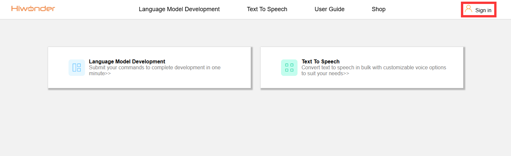

(3) If already registered, log in and click **"Language Model Development"** to start creating the language model.

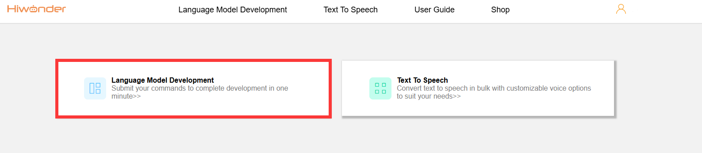

(4) Click **"New Program"** in the top left corner to create a new project.

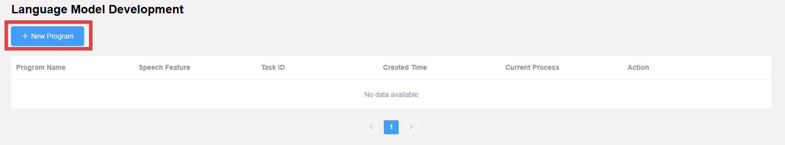

(5) In the **"Program Name"** field, enter a project name of your choice. For example, we use **"WonderEcho"**.

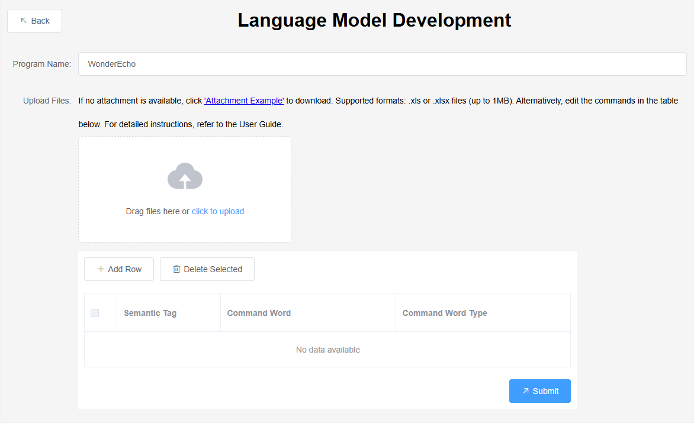

(6) To add command words, you have two options:

*   **Edit directly on the panel:** Click **"Add Row"** to manually input command words. Ensure all words are in **uppercase** and separate multiple words with hyphens (**-**).

*   **Upload a sample file:** Click **"Attachment Example"** to download a template. Edit the file in Excel according to the format, then upload it. The system will automatically process the data.

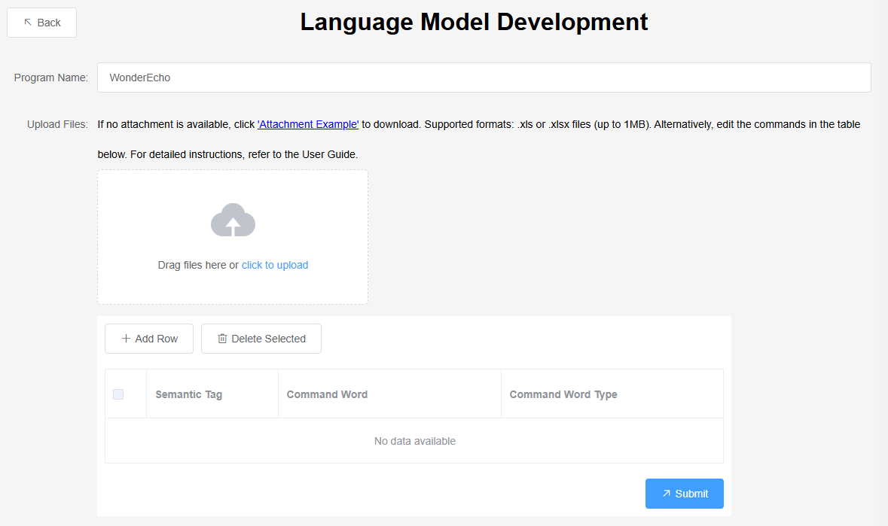

(7) We opt for the first method—direct editing. Click **"Add Row"** to add a wake-up command. Ensure the command is written entirely in **uppercase**, and use hyphens (**-**) to separate multiple words. Finally, set the command type to **"wake-up"**.

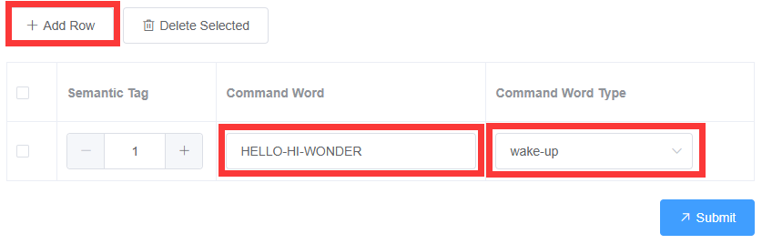

(8) Similarly, add two more command words for recognition, setting their types to **"command"**. Once done, click **"Submit"** to complete the setup.

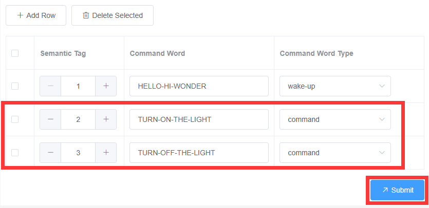

(9) Wait for the platform to process the model. After processing, click **"Download"** on the right to save the model to your local device.

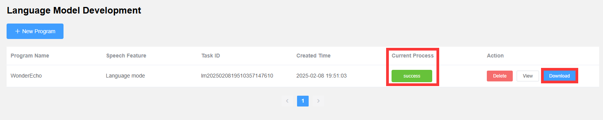

(10) Next, click **"Text To Speech"** to create the broadcast voice prompts.

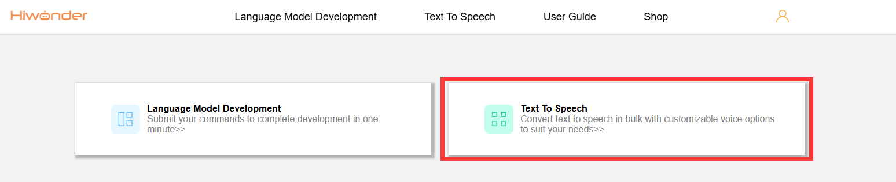

(11) Click **"New Program"** in the top left corner to create a new project for speech synthesis.

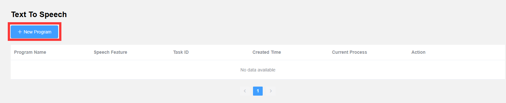

(12) Choose a voice type for playback, such as **"Mia-English female voice"**, and set the volume to the default value of **15**.

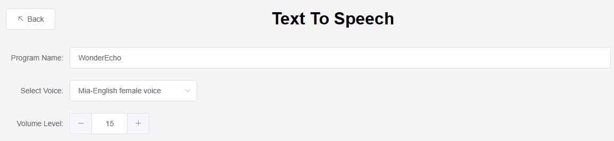

(13) Add three broadcast statements corresponding to the command words created in **"Language Model Development"**. In the **"Audio"** column, input the response for each command. For example, if the command **"HELLO-HI-WONDER"** is recognized, enter **"I am here"** as the response. Click **"Submit"** once completed.

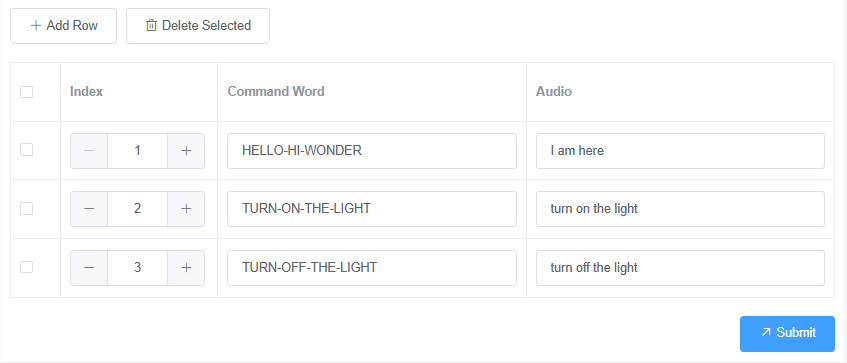

(14) Wait for the platform to process the text-to-speech data. After processing, click **"Download"** on the right to save the audio files to your local device.

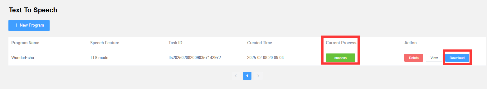

### 5.1.3 Integrate Language Model

(1) Extract the files starting with **"lm"** from the **"Language Model Development"** folder that you downloaded.

(2) Copy the **\[60000\]{cmd_info}.xlsx** file from the **"CmdWordStructure"** folder to the [Firmware Development Tool\CI130X_SDK_Offline_uart_1_12_16\projects\cwsl_A_sample\firmware\user_file\cmd_info](https://drive.google.com/drive/folders/1efqsA95PbBs_dRr-BbNYG_BOKanbrx51?usp=sharing) folder.

(3) Copy the file **\[0\]asr_english_CI1302_V00916.dat** from the **"GfstCmd"** folder and paste it into: [Firmware Development Tool\CI130X_SDK_Offline_uart_1_12_16\projects\cwsl_A_sample\firmware\asr](https://drive.google.com/drive/folders/1efqsA95PbBs_dRr-BbNYG_BOKanbrx51?usp=sharing).

(4) Copy the file **\[1\]asr_english_CI1302_V00916.dat** from the **"GfstWake"** folder and paste it into: [Firmware Development Tool\CI130X_SDK_Offline_uart_1_12_16\projects\cwsl_A_sample\firmware\asr](****) folder.

### 5.1.4 Integrate Text To Speech

(1) Extract the file starting with **"tts"** from the **"Text To Speech"** download.

(2) Copy all audio files (`*.wav`) to the folder: [CI130X_SDK_Offline_uart_1_12_16\projects\cwsl_A_sample\firmware\voice\src](https://drive.google.com/drive/folders/1efqsA95PbBs_dRr-BbNYG_BOKanbrx51?usp=sharing)

### 5.1.5 Firmware Integration

Open the [Firmware Development Tool\CI130X_SDK_Offline_uart_1_12_16\projects\cwsl_A_sample\firmware\Combine bin.bat](https://drive.google.com/drive/folders/1efqsA95PbBs_dRr-BbNYG_BOKanbrx51?usp=sharing) file and wait for the firmware integration to complete. The window will automatically close once the process is finished.

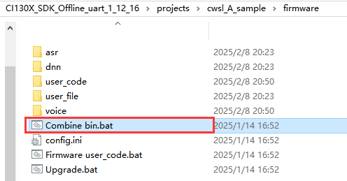

### 5.1.6 Firmware Flashing

(1) Connect the voice interaction module to the PC using the Type-C data cable.

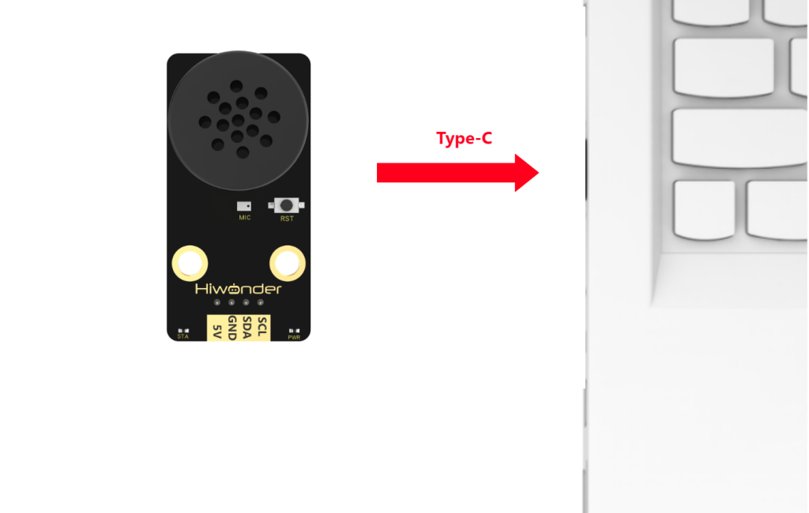

(2) Open the **"Upgrade.bat"** file located in the [Firmware Development Tool\CI130X_SDK_Offline_uart_1_12_16\projects\cwsl_A_sample\firmware](https://drive.google.com/drive/folders/1efqsA95PbBs_dRr-BbNYG_BOKanbrx51?usp=sharing) folder, which can be found in the same directory as this document, and then click on **"Packaging"**.

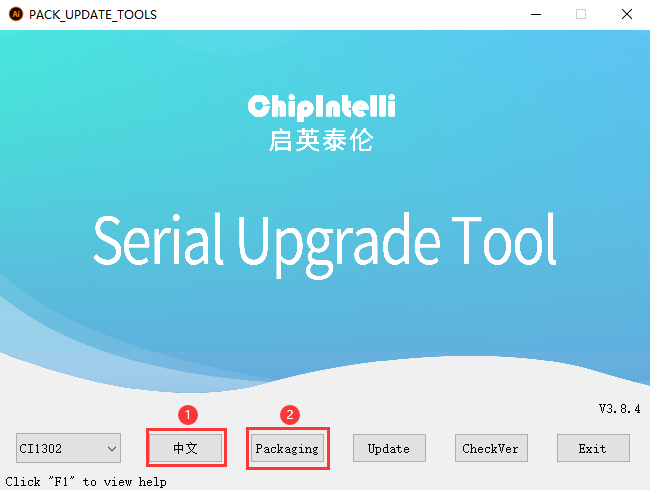

(3) First, click the **"Auto-allocate"** button to automatically allocate resources. Then, click on **"Packaging"** to merge the firmware and wait for the process to complete.

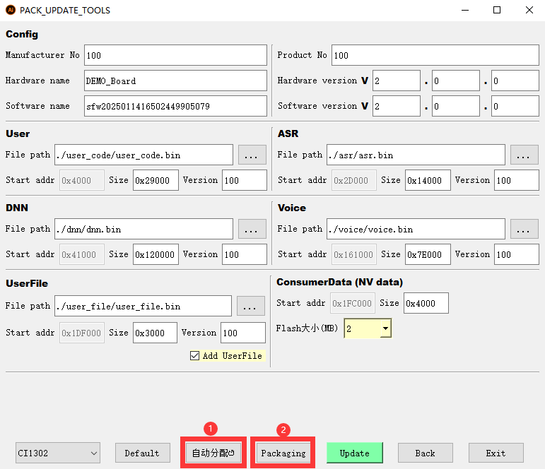

(4) Once the process is complete, the packaged firmware will be saved in the following path: [Firmware Development Tool\CI130X_SDK_Offline_uart_1_12_16\projects\cwsl_A_sample\firmware](https://drive.google.com/drive/folders/1efqsA95PbBs_dRr-BbNYG_BOKanbrx51?usp=sharing).

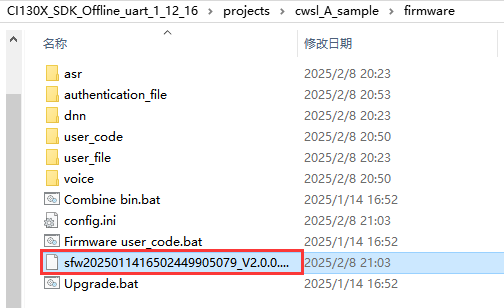

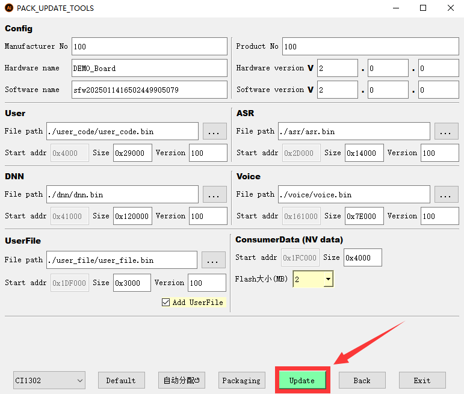

(5) Click on **"Select firmware"** and locate the firmware generated in step 4, then select it.

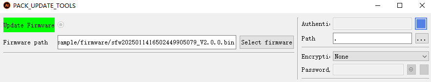

(6) Locate the corresponding serial port and click on the right side to select it.

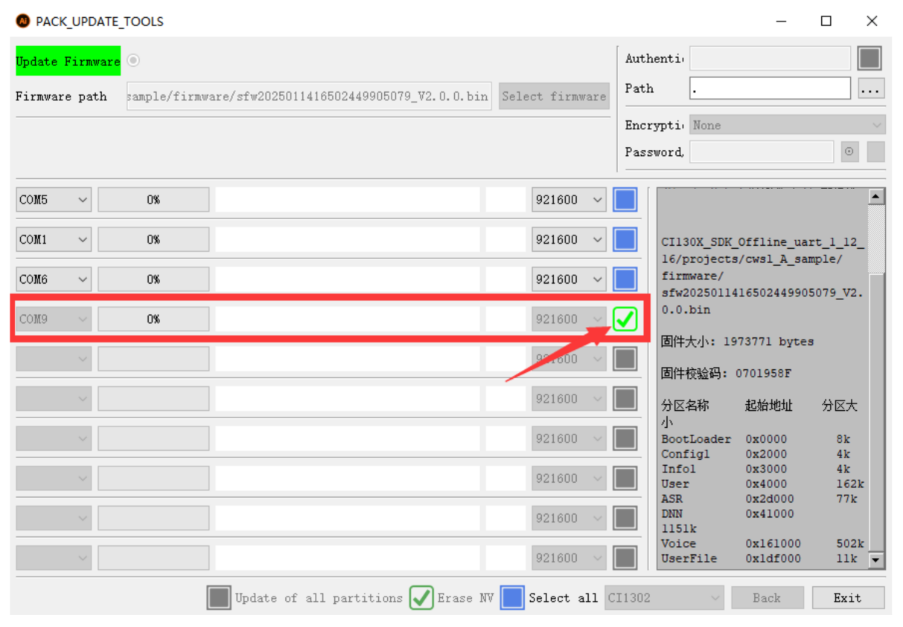

(7) Next, press the **"RST"** button on the voice interaction module to begin the flashing process. Wait for the flashing to complete successfully.

