# 5. Firmware Development

## 5.1 WonderEcho Firmware Development

This lesson covers the creation and flashing of firmware for the WonderEcho module.

### 5.1.1 Notification

The module comes pre-programmed with speech recognition firmware from the factory. This factory firmware file is available within the same directory as this document. Follow the provided instructions to rebuild the firmware if custom creation is necessary.

###  5.1.2 Firmware Creation and Flashing

1)  Navigate to the official firmware creation website at [https://aiplatform.chipintelli.com/home/index.html](https://aiplatform.chipintelli.com/home/index.html). The platform interface defaults to Chinese, so utilization of the browser translation feature is recommended to switch the language to English for easier navigation.

2)  Access the ChipIntelli Voice AI Platform, click **Platform Features** in the top menu, and select **In-depth development of product Firmware & SDK** under the Product Development section.

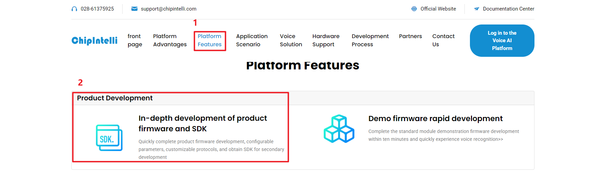

3. A login prompt will appear. Since standard registration requires a specific regional mobile number, a shared account is provided for international developers:  

   **Username: 18033085495  
   Password: hiwonder**

4. Upon successful login, click **Offline speech recognition large model application** to enter the development section.

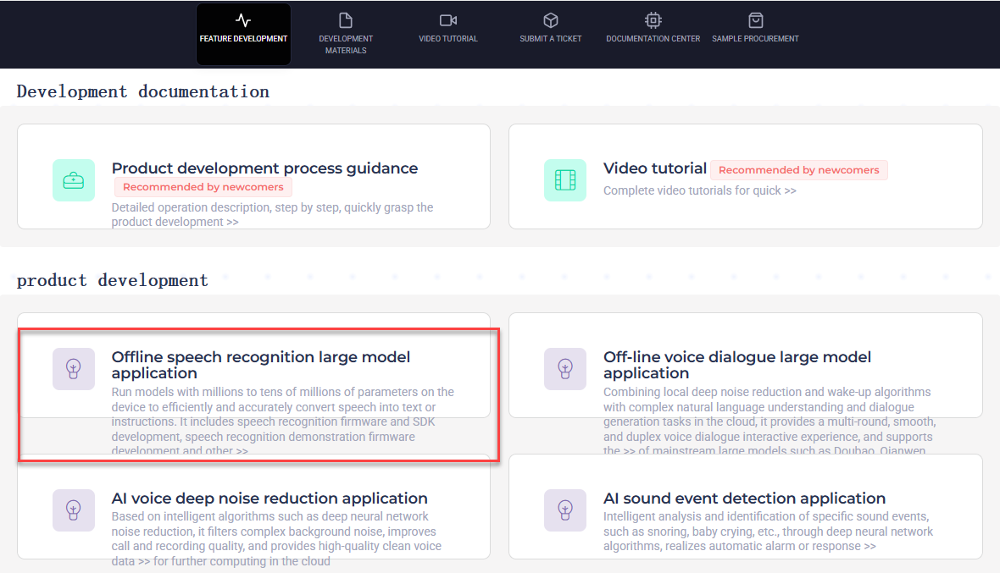

5)  Click **Speech recognition firmware and SDK development** in the submenu to access the corresponding section.

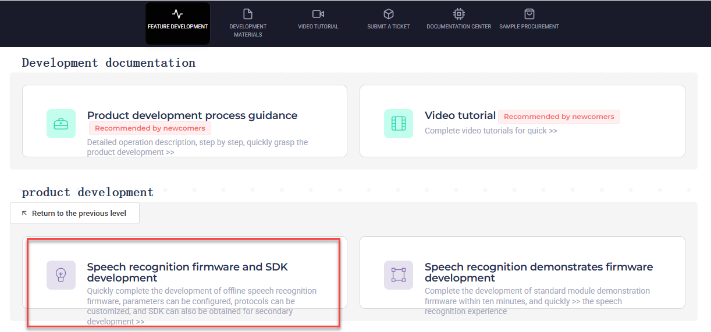

6)  Click **New projects** in the left sidebar to initialize a new project.

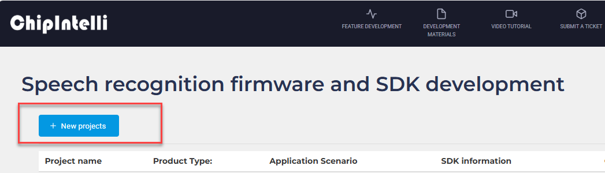

7)  Input a customized Product Name and Description. For the remaining fields, apply the options indicated by the red box, specifically selecting **General** and then **Intelligent central control** for the Product Type. Click **Create** once these configurations are complete.

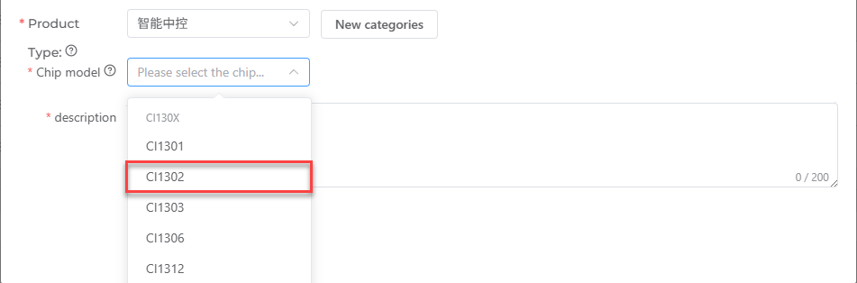

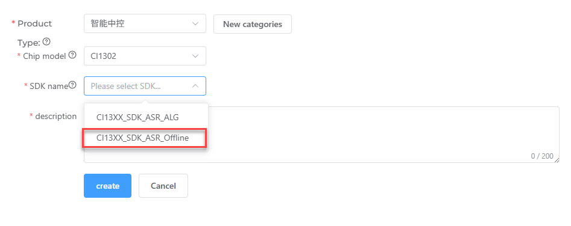

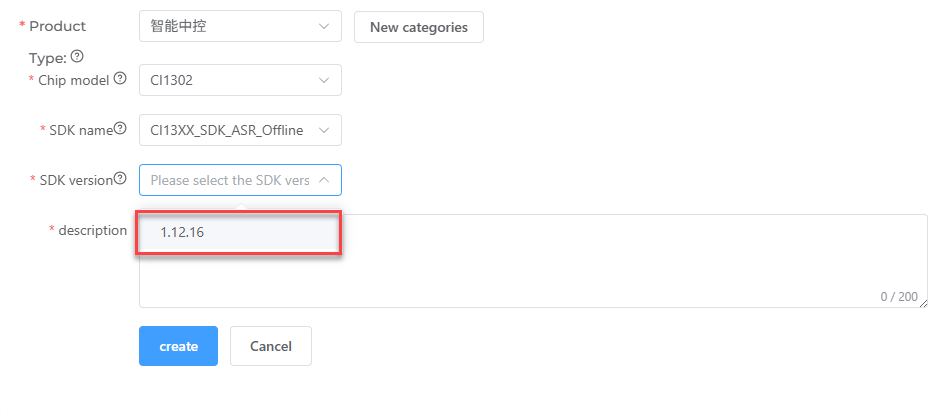

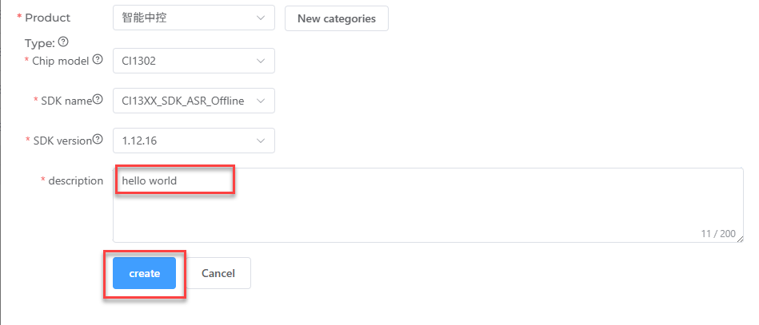

8)  Set the project language next. Select **English** under Language Type to configure English voice recognition. Click **Continue** to proceed after selecting the appropriate options.

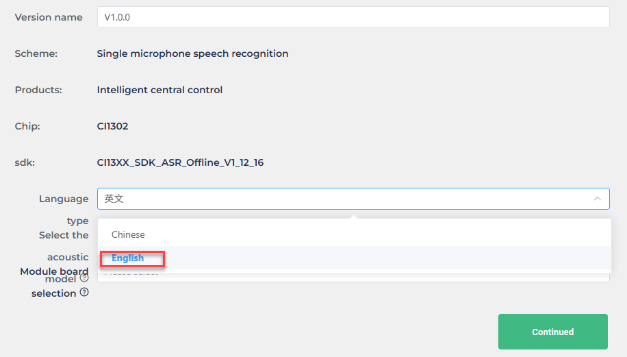

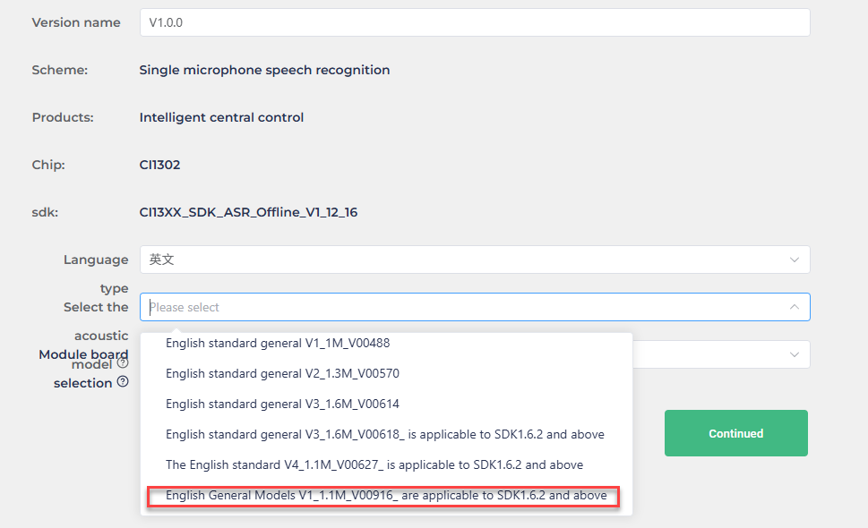

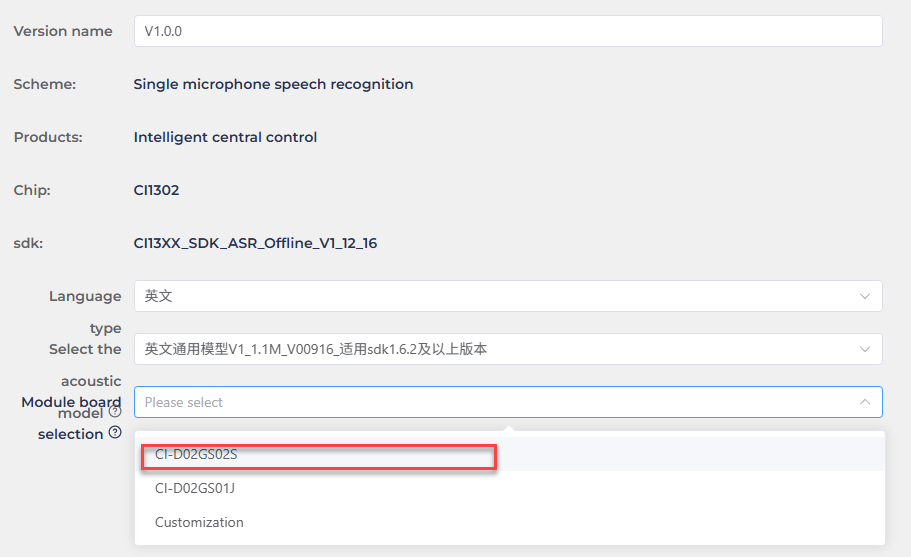

9)  Important adjustments are required within the firmware configuration interface. Begin by enabling the **Echo Cancellation** feature under Algorithm Settings.

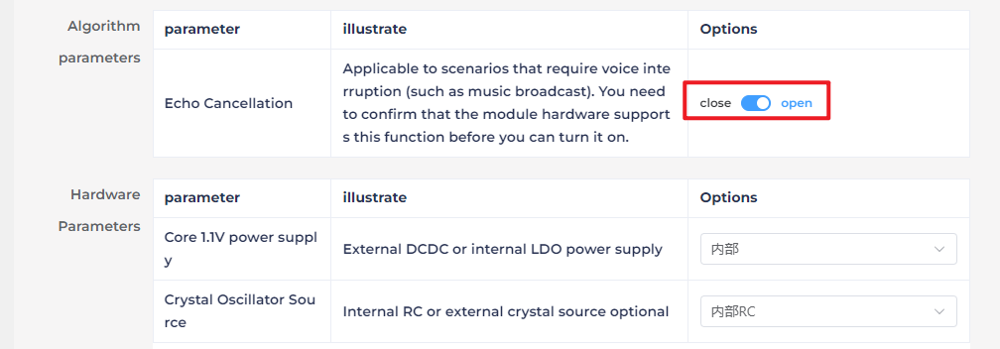

10) Set the oscillator source to **Internal RC** and disable the **Baud Rate Calibration** function under Hardware Settings.

11) Configure **UART0** to **Open-Drain Mode** within the UART Print Settings, ensuring support for an external 5V pull-up.

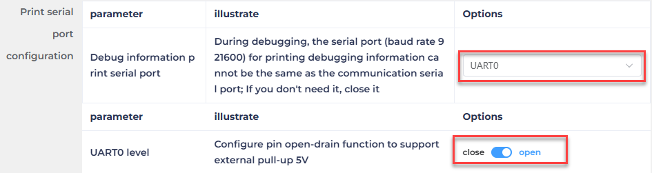

12) For Communication UART Settings, set the Baud Rate to 115200 and configure UART1 to Open-Drain Mode, also supporting external 5V pull-up. After adjusting these settings, click **Continue** to move forward.

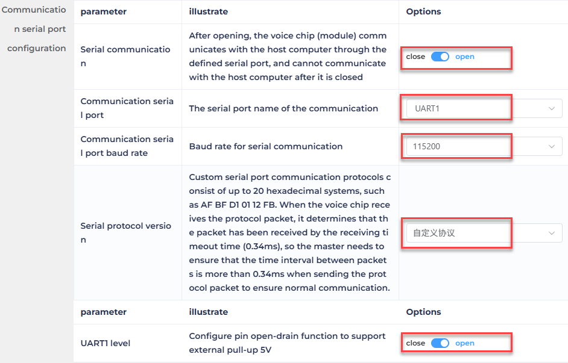

13) The subsequent step involves command word configuration. A voice output must be selected for the wake-up command. Select **Dane - English Male Voice** as the output voice for this example. The choice between Chinese and English voices depends entirely on the language settings configured previously.

14) Upload the command word attachment by locating the file named **Command Phrase and Playback Protocol List** and dragging it directly onto the webpage.

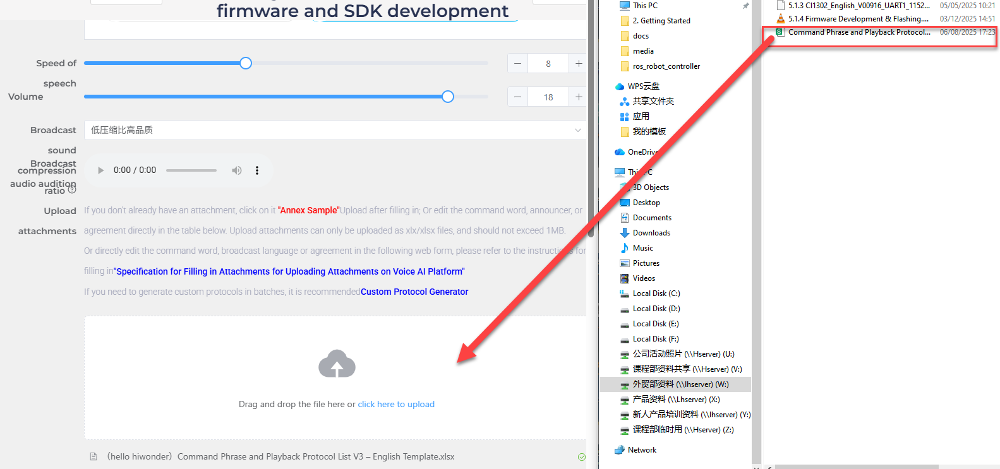

15) The command data populates the table below automatically after the file uploads.

> [!NOTE]
>
> **The English firmware version exclusively supports English wake words, and mixed-language wake words are invalid. Furthermore, English wake words must be written in uppercase letters to ensure proper functionality.**

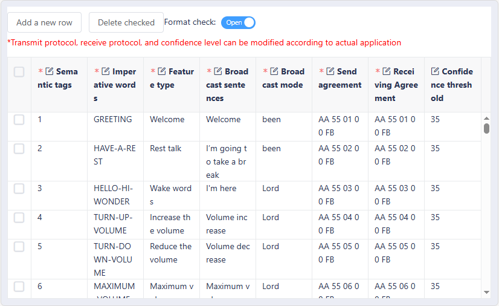

16. Enable **switching Self-learning** and select **Designated study**. The system automatically generates four self-learning commands, which require no changes during this step.

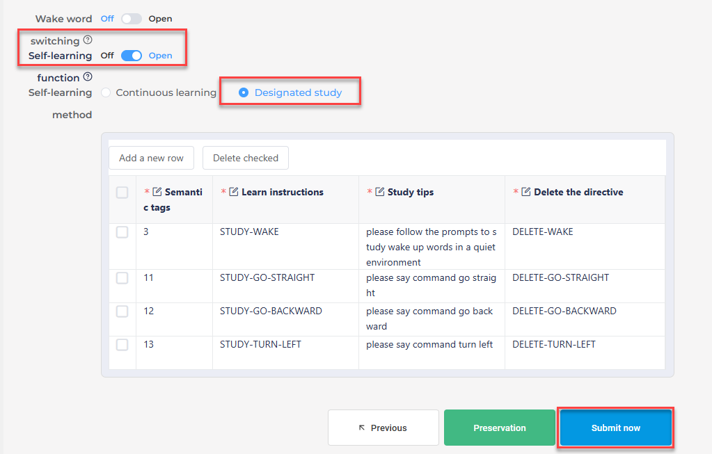

17. Click **Submit now** and allow a few minutes for the firmware generation process to complete. Click **Download** once finished to obtain the customized firmware.

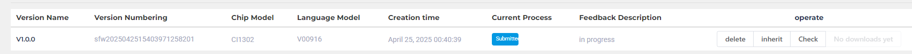

18. Extract the downloaded archive. The resulting folder contains a .bin file, representing the custom firmware generated from the uploaded **Command Phrase and Playback Protocol List** file. Proceed to the **5.1.3 Firmware Flashing** section in this document to deploy the firmware to the module.

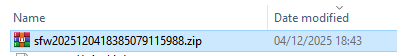

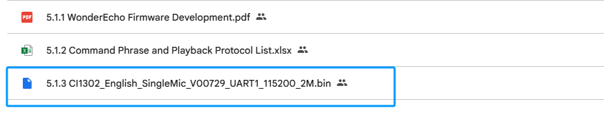

###  5.1.3 Firmware Flashing

1)  Connect the voice interaction module to the computer using a Type-C data cable.

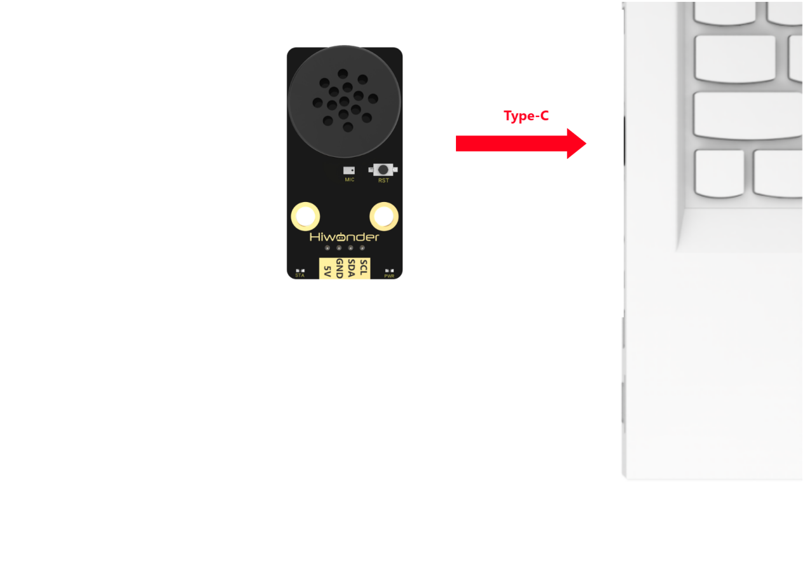

2)  Launch [Firmware Development Tool\PACK_UPDATE_TOOL.exe](https://drive.google.com/drive/folders/1oxdaycGexBoikc8kI1Ha2SbNEz4KksHT?usp=sharing) located within the same directory as this document, choose the **CI1302** chip, and click **Update**.

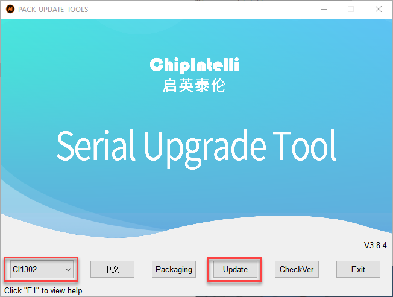

3)  Click **Select firmware**, then locate the .bin firmware created in the previous steps. Here, the factory firmware **CI1302_English_SingleMic_V00729_UART1_115200_2M.bin** in the same directory as this document is used as an example.

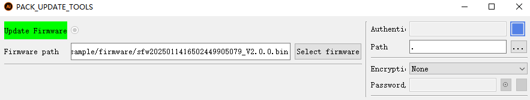

4)  Locate the appropriate serial port and select it.

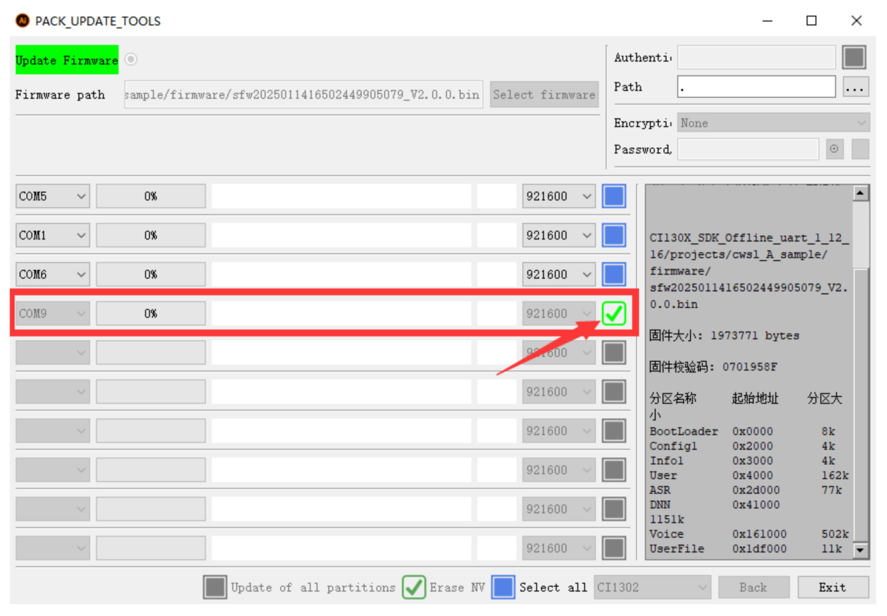

5)  Press the **RST** button on the voice interaction module to enter flashing mode, then wait for the process to complete successfully.

## 5.2 Modifying Functional Phrase Entries

The procedure for modifying functional phrase entries is outlined below.

1. Open the **Command Phrase and Playback Protocol List** spreadsheet located in the same directory as this document.

2. Locate the functional phrase entries in the spreadsheet, which correspond to the first 10 items. These initial 10 functional phrases are fixed entries that do not support additions, meaning only modifications are permitted.

3. As an example, modify the wake word response phrase. Originally, the module plays back **I'm here** when **HELLO-HI-WONDER** is recognized. Change the playback phrase to **Hiwonder is here**.

4. The wake word itself is also customizable. For example, set the wake word to **HELLO-ROBOT** and configure the module to play back **I'm here** upon activation.

5. Save the spreadsheet after completing the modifications. Follow the steps detailed in [5.1 WonderEcho Firmware Development](#p5-1) to upload the spreadsheet to the website. If firmware was created previously, click **Inheritance** within the existing project to reuse the configuration and bypass parameter setup.

6. Rebuild the firmware and flash it to the voice interaction module to apply the updated functional phrase entries.

## 5.3 Adding New Command Words

The procedure for adding new command words is outlined below.

1)  Open the **Command Phrase and Playback Protocol List** spreadsheet located in the same directory as this document.

2)  Add a new command word at the bottom of the spreadsheet, such as **SHOW-RED-LIGHT**.

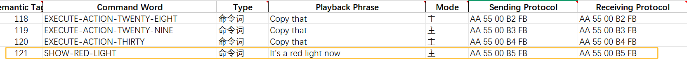

3. Set the function type to **Command Word** and the playback mode to **Auto**. This ensures that when **SHOW-RED-LIGHT** is recognized, the module will automatically play back **It's a red light now**. 

   > [!NOTE]
   >
   > **In the spreadsheet, select “命令词” for command word type and “主” for auto mode.**

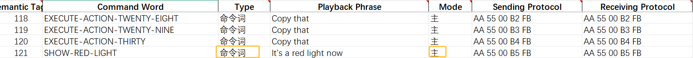

4)  Review the sending protocol. The first and second bytes form the data frame header and require no modification. For command words, the third byte must be set to **00** to distinguish between a command word and a playback phrase.

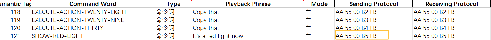

5)  The fourth byte represents the command word ID in hexadecimal. If the previous command word ID was B4, this new command word should be assigned B5. In special cases, IDs can be duplicated when two command words need to produce the same result.

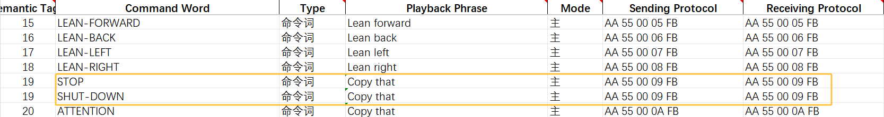

6)  The fifth byte in the protocol is fixed at “FB” and does not require modification. Ensure that the sending and receiving protocols match in the spreadsheet.

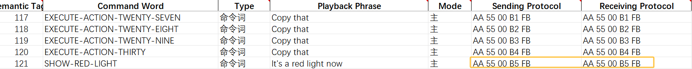

7)  Save the spreadsheet after implementing these changes. Follow the steps in [5.1 WonderEcho Firmware Creation](#p5-1) to upload the spreadsheet to the platform. If firmware was generated previously, click **Inheritance** in the existing project to reuse the configuration and skip parameter setup.

> 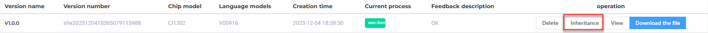

8)  Rebuild the firmware and flash it to the voice interaction module to deploy the new command word functionality.

## 5.4 Adding New Playback Phrases

The procedure for adding new playback phrases is outlined below.

1)  Open the **Command Word and Playback Protocol List** spreadsheet located in the same directory as this document.

2)  Add a new entry at the bottom of the spreadsheet, such as the playback phrase **It's a green light now**.

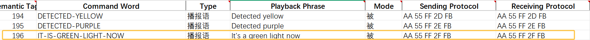

3. Set the function type to **Playback Phrase** and the playback mode to **Passive**.

   > [!NOTE]
   >
   > **Note that 播报语 must be selected for the playback phrase type and 被 for the passive mode within the spreadsheet.**

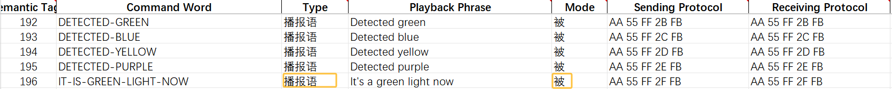

4)  Review the sending protocol. The first and second bytes represent the data frame header and require no modification. For playback phrases, the third byte must be set to **FF** to classify the instruction specifically as a playback phrase.

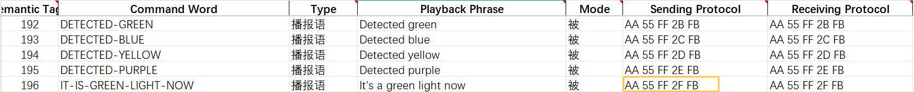

5)  The fourth byte represents the command word or playback phrase ID in hexadecimal. If the previous playback phrase ID was **2E**, this new phrase must be assigned **2F**.

6)  The fifth byte in the protocol is fixed at **FB** and requires no modification. Ensure the sending and receiving protocols match exactly within the spreadsheet.

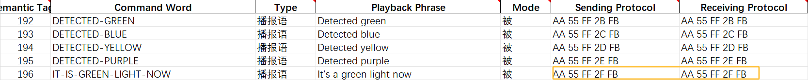

7)  Save the spreadsheet after applying these changes. Follow the steps in [5.1 WonderEcho Firmware Creation](#p5-1) to upload the spreadsheet to the website. If firmware was developed previously, click **Inheritance** in the existing project to reuse the configuration and skip parameter setup.

8)  Rebuild the firmware and flash it to the voice interaction module to enable the new playback phrase functionality.
